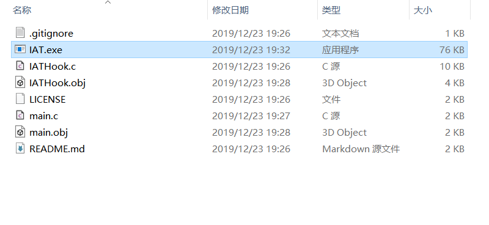
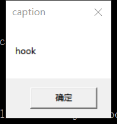
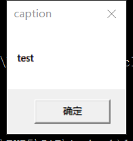
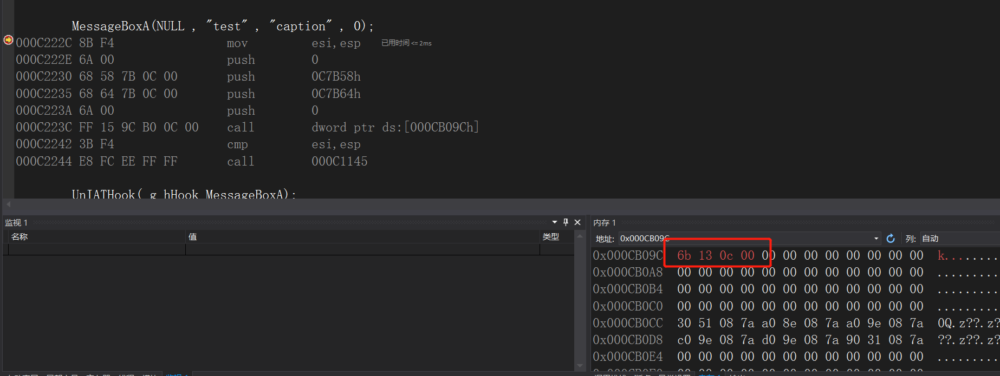

# IATHook
## 实验目的
* 了解IATHook的攻击原理并进行实验
## 实验完成度
* [x] 
## 实验步骤
### MessageBoxA实例运行
1. git仓库[下载](https://github.com/tinysec/iathook.git)IATHook的实例             
```bash
cd D:\YearJunior1\SoftwareProjectSecurityDevelopmentLifecycle\EXP5\IAT
git clone  https://github.com/tinysec/iathook.git      
```
2. 将文件中的readme.md复制为main.c,并且将不是代码的部分删掉，使编译能够通过
3. 使用vs的开发者工具，转到目录                  
```bash
cd D:\YearJunior1\SoftwareProjectSecurityDevelopmentLifecycle\EXP5\IAT\iathook
```
4. 进行编译链接，生成IAT.exe           
```bash
cl /c IATHook.c
cl /c main.c
link main.obj IATHook.obj user32.lib /out:IAT.exe
```           
              
6. 运行一下EXE,```IAT.exe```,会发现生成了两次弹窗                              
           
               
7. 新建一个工程```D:\YearJunior1\SoftwareProjectSecurityDevelopmentLifecycle\EXP5\Hook```
```wmain```,```iathook```和中间的```MessageBoxA```中间也下断点。执行到message，会发现这个位置改变,说明攻击的就是这里                                          
                                

### 对记事本进行攻击 

## 实验问题

## 实验结论

## 参考资料
* [IATHook实例仓库](https://github.com/tinysec/iathook.git)              