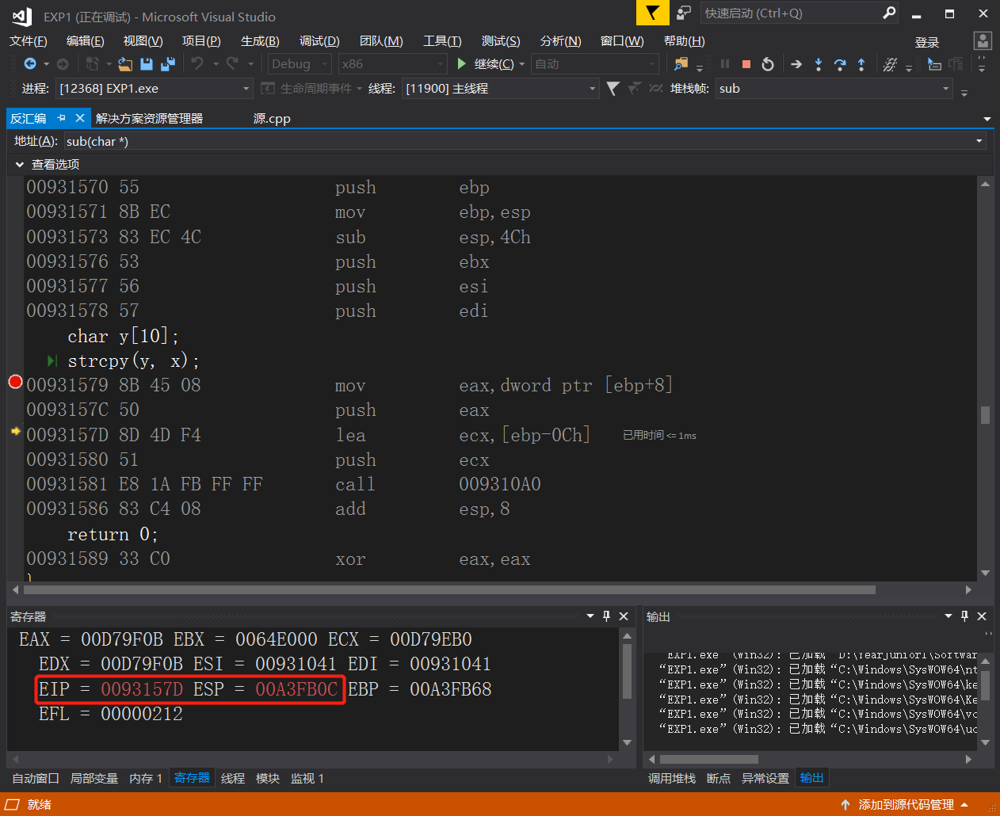
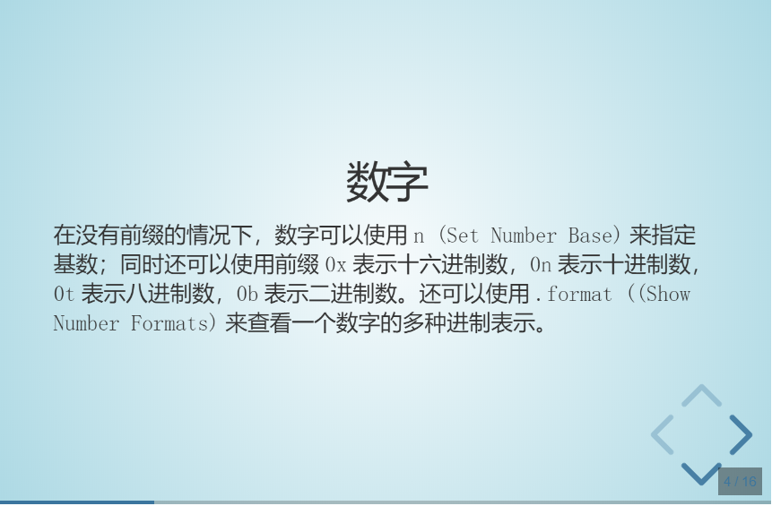

主讲师： 范文庆
# SoftwareProjectSecurityDevelopmentLifecycle
## **第二节课(2019.09.17)**
***
### 软件的执行原理
* cl  
clang  ---> .c/.cpp->.exe/PE 编译链接  
gcc   

### C语言（CPU直接运行，原生应用程序）
PROGRAM FILE->LLVM->bin 下的clang放入环境变量   

1. 编写C
    ```
      #include<stdio.h>
      #include<stdlib.h>
      int main()
      {
          printf("hello")；
      }
    ```
    保存
2. 进入.c目录  
3. clang hw.c  
    可以得到可执行文件
4.  winhex打开一个.exe和对应的.c文件    
     ctrl+F 可以搜索hello   
     h: ASCII 0x68对应winhex   
     0x20-0x7E 才有对应字符  
     .c 只有小于20的，是换行符
### Python运行(脚本程序)
1. python加入环境变量
2. 进入.py
3. pyhon a.py   
   没有变成a.exe，但必须在python.exe下运行
   python.exe 读取a.py,分析指令，调用库执行，突破CPU只能执行二进制的局限，不需要编译
3. vscode debug 选择pythonfile或者sdd congrifion 

### JS(脚本程序)
1. 打开网页小游戏
2. 产看源代码，script，.js   

 
## **第三节课(2019.09.18)**
***
### 复习
1. 进入目录
2. clang hw.c
3. 会有一个a.exe
4. clang -c hw.c 多出一个hw.o   
   .c->(编译)->.o->（链接,多个链接拼接成一个文件）->.exe 
  
   这是原生应用程序 hufive app   
   python等必须有原生应用程序的解释器  
<font color=Tan>特点：直接，性能好，开发难（用.c/cpp）</font>
### 反汇编
1. 打开vs,找到tool command
2. 切换到.exe目录
3. dumpbin /disasm a.exe  

### HTML

* 硬件->OS->原生APP,浏览器  
浏览器：1. http client网络   
       2. 解析，显示
       3. 脚本执行器，交互，数据，动态效果


1. 打开wireshark,开始抓包
2. 访问网页，停止抓包
3. 过滤器输入http
       

### Python 代码
* 下载lxml import lxml etree
* <font color=steelBlue>head字段：伪装成浏览器</font>
* xpath：通过路径定位元素  
html/body/div/fext()（函数，获取文本）
//div[class='a']（属性）
选好演出名称:右键->copy->xpath
tr/td[1]:所用表格的第一例
   
## **第四节课(2019.09.24)**
***
### 使用GitHub的步骤  
1. 设置公钥    
   * 右击git.bash.，然后输入
    ```ssh-keygen -t rsa -b 4096```
    一直回车
    存储在（C:\Users\18801\.ssh\id_rsa.pub）
    * github->settings->ssh，new ssh
### 库的安装
1. ``` python -m pip install lxml ``` 
   [网上搜索python使用国内源，加快下载速度](https://blog.csdn.net/lambert310/article/details/52412059) 
   ```python -m pip install -r requestments.txt```直接下载所有包   
  写一个requestments.txt包含所有需要的库

### 登陆界面
1. 下载chromedriver，放在py同一目录
2. py->selenium->chromedriver->chrome
     
用户登录，信息提交，且能呈现给其他人
论坛，bbs,社区，微博
##作业：
有跨站脚本的漏洞的程序，没有脚本过滤，然后利用
ID，名称，时间
2. 写python爬虫，自动提交和验证网页有这样的漏洞（自己提交，看一下结果中有没有脚本）

存储型的xss

## **第五节课(2019.10.08)**
****
###  跨站脚本攻击（xss）
UserA----(.JS)>
                   ----     Sever
UserB-----(.js,执行)>   
前端会解释script标签
对用户的提交
### SQL注入
危险：造成数据泄露，写入数据库   

### 程序漏洞
``` c
#include<stdlib.h>
#include<string.h>
#include<stdio.h>

int main(int argc,char** argv)
//char** : 字符串数组   
//argc:输入参数个数   argv:输入参数的值
//程序本身也要占一个
//eg: git clone http://.....
//argc=3,argv[1]=clone
{
  char y[10];
  if(argc>1)
  {
    strcpy(y,argv[1]);
  }
}

//改进
strcpy_s(y,strlen(x),x)   ❌
strcpy_s(y,10,x)           ✔
```
会造成写入越界   bufffer is too small
属性中的：启用C++异常，基本运行检查，安全检查防止了崩溃    
安全漏洞都是由于当年设计机制不规范  

### 推荐漏洞网页
* CVE
* CNNVD
* CNVD

### 网页
* 启动httpd
netstart -l(查看端口：80)
127.0.0.1 \a html
* 客户端作用：
取内容
渲染
执行动态脚本  
* GET,POST 
### 作业
httpd,阿帕奇,Django（MVT,MVC）
* MVT
m:数据模型，数据库的表结构  
v:视图
T：页面模板    

动态网页的htnl是由程序生成的（cgi）

写一些简单的动态脚本，php在nginx(做一个乘法器in:1 out:2)      

详细：
* 静态的html站点的建立
抓包其抓包HTTP整个响应过程

* apache等建立一个动态的执行过程，php,可以根据用户请求动态生成，调用数据库

* Diango快速构建一个web应用，按照mvt
渲染  {{变量名}}   
主体框架是静态的，内容是动态的   

### Diango
https://docs.djangoproject.com/en/2.2/intro/
ORM


## **第六节课(2019.10.15)**
****
### 缓冲区溢出漏洞

>>文件所处位置  
>>D:\YearJunior1\SoftwareProjectSecurityDevelopmentLifecycle\EXP1   

```c
#define _CRT_SECURE_NO_WARNINGS
//没有这一行代码会错误，因为strcpy是不安全的，这个不让报错
// CRT:C RUN TIME

#include <stdlib.h>
#include <stdio.h>
#include <string.h>

int sub(char* x)
{
	char y[10];
	strcpy(y, x);  //❌
	return 0;
}

int main(int argc, char** argv)
{
	if (argc > 1)
		sub(argv[1]);
	printf("exit");
}

```
修改以下几个属性


* sub函数调用strcpy
1. debug运行状态
2. 下断点在strcpy，开始调试

3. 转到反汇编，去掉显示符号名，上面三个都勾上
4. 调试-》窗口-》内存（输入eip），寄存器   
 EIP 指令指针寄存器
   
 
5. F10,EIP,EAX都改变
  eax就是x的地址，ecx是y
  内存-》eax
   “9”-》“0x39”   00字符串结束
6. F10再执行一步   
栈：函数调用这样的问题

7. 输入esp

8. F10,停在call处在的位置，F11进入函数
    
ESP: 19FE34 ->-4->19FE30->-4->19FE2C->-4->19FE28(call指令也入栈了一个数据，call指令的下一条地址)   
局部变量也位于栈中    

* main函数调用sub
1. mian中加一个断点

2. 执行完call strcpy

3. return后，去到了39393939地址（这个是用户输入的，而不是程序员自己写的）sub下一条指令的地址被破坏   

如果此时进入到的地址是黑客写的代码的地址，那么就会造成安全漏洞
4. add esp 8回退
* 总结
1. ebp用来定位局部变量的 
2. 总过程


### 作业
  重复上课的内容，写实验报告，md,放在github上，将链接给学委          

## **第七节课(2019.10.22)**     
***
### 必备素质     
  * git 
  * github 
  * pro git
  * markdown->可对比，版本化管理，格式，格式简洁
  * 原生应用程序 .exe(windows) .c/.cpp/.elf(linux) 和web（网络）应用程序    
### 程序执行
  * 程序执行过程通过程序（debuger）调试器进行观察
  * debuger
  vs自带的/windebuger          gdb     
  两代流派 vc和 gnu      
  vc: cl.exe,link.exe,sok       
  gnu: gcc（编译器）,libc
  * 断点/单步执行/反汇编/内存/查看寄存器
### 堆溢出
  * 与malloc和free函数有关，多次malloc,多次不定时free 
  * 无法预估需要多大的内存
  * 实验
  ``` c
  #include<stdlib.h>
  #include<string.h>
  #include<stdio.h>
   
  void hack()
  {
    printf("hacker!");
  } 

  int main(int argc,char** argv)
  //char** : 字符串数组   
  //argc:输入参数个数   argv:输入参数的值
  //程序本身也要占一个
  //eg: git clone http://.....
  //argc=3,argv[1]=clone
  {
    char y[10];
    if(argc>1)
    {
      strcpy(y,argv[1]);
    }
  }

  ```       
  1. 基本属性的调试          
         
              
                


  需要补笔记


## **第八节课(2019.10.29)**
  * exe->API->Textout    GDI->控件
  屏幕取词：重载了textout
  * 线程与进程         
  （windows/linux核心编程/深入理解计算机系统      intel programming）   
           
    1. createthread函数，创建函数         
    2. 
                
    3. main->主线程           
    4. 
                
    5.  
               
    6. 从[CreateThread函数基本参数解释](https://docs.microsoft.com/en-us/windows/win32/api/processthreadsapi/nf-processthreadsapi-createthread)中下载例子       
                    
    7. [实例函数在这里](D:\YearJunior1\SoftwareProjectSecurityDevelopmentLifecycle\EXP2)        
    将3改为10
                   
    8. 执行           
           
    总体是一种随机性，但是多运行几次，会发现小的在上
    9. 修改
                  
                   
          
    10. 修改      
                
                  
               
    11. 重新编译运行
               
    每个线程都sleep了1000但是总体时间只用了1032，所以相当于所有线程都是同时执行
    12. 
                    
                
             
    最后tick count时间为一万多             

  * 进程
  [createprocess msdn](https://docs.microsoft.com/en-us/windows/win32/api/processthreadsapi/nf-processthreadsapi-createprocessa)
  example里面的代码copy下来
  ```
  cd D:\YearJunior1\SoftwareProjectSecurityDevelopmentLifecycle\EXP3\Debug
  EXP3.exe
  EXP3.exe "EXP3.exe notepad.exe"
             
  ```
         
  2. 关闭notepad,EXP3也消失
                 
  1. processExplore


## **第九节课(2019.12.03)**

### [Windebug课件](https://anjingcuc.github.io/courses-wiki/substitute/windbg/)
    


            
            
           
ctrl+ E：打开.exe
ctrl+s, 拖符号pdb 符号文件，
ctrl+p源文件所在的文件夹

bu .exe名字!main
g

关掉

* 换64位的windeug
ctrl+ E：打开cal.exe（c->windows->system32）         

.symfix C:\symbols
.sympath

           

bu calc!wWinMain
g


               
g

                
#### 666改成999
调试器监控运行，下断点，
* 在SetWindowsTextW处下断点 function
1. 
打开计算器->F6(attach to process)->找到计算器.exe
            
2. bu user32!SetWindowsTextW
              

#### 打开记事本
```
.symfix C:\symbols
.sympath
x kernel32!WriteFile*
```
              


               
```
bu kernel32!WriteFile
bu kernel32!WriteFileEX
bl
g
保存记事本
```
*未完待续……*

## **第十节课(2019.12.10)**
> [Windebug课件](https://anjingcuc.github.io/courses-wiki/substitute/windbg/)
>
> [官方命令](https://docs.microsoft.com/zh-cn/windows-hardware/drivers/debugger/)

### 常用命令


指令	   作用
.symfix	指定本地缓存目录
.sympath	设置符号路径，包括本地缓存和远程符号服务器
.reload	重新加载模板
x	查看模块符号
bu	下断点
bl	列出断点
g	继续执行程序
k	查看调用堆栈 
lm	列出当前进程加载的模块              
u: 查看后续的n条指令
上下键：翻页
esc：清空所有内容
n: 查看进制
> [微软官方文档 - WinDBG 命令](https://docs.microsoft.com/zh-cn/windows-hardware/drivers/debugger/using-debugger-commands)

>上次失败原因：记事本调用的不是kernel32里面的WriteFile而是kernelbase里面的，可以用processmonitor查看

### 表达式
           
>PPT中 format 改为 formats
* ```.expr```查看当前表达式的处理器
* ```.expr /s c++```可以改变，一般情况下不改
* 两个窗口类似vs的局部变量和监视器
               

### 数字
                
* ```n```查看几进制
* ```n 10```修改为10进制
### 符号
            

### 别名
              
别名其实是一个宏
              
```
as demo 5+1（这是一个表达式，不会算）
as /x demo 5+1 （会计算）
# 固定别名
r $.u0 = 5+1
.echo $u0
${} 展开
```
### 调试脚本
               
* 不退出调试器，重新执行            
              
* 调试
  1. windebug打开windows下面的记事本
  2. 下断点
  ```
  bu kernelbase!writefile ".echo hello;g"
  bl
  g
  ```
             
  3. 记事本弹出，随便输，然后保存，会输出hello                  
                 
  4. 将命令写到记事本中                 
                  
  5. 引入脚本文件                 
  ```
  bu kernelbase!writefile "$><C:\\Users\\18801\\Desktop\\c.txt"
  g
  ```
              
  * 脚本实例     
  ```
  .foreach (value {dd 61000 L4})
  {
   as /x ${/v:myAlias} value + 1
   .block{.echo value myAlias}
  }
  
  //foreach: 每行执行
  //dd: 查看内存内容  6100：地址   L4后面四个地址的内容
  //value: 每次查看的内容赋值给value
  //{
  //echo value
  //}
  //ad myAlias
  ```
### 演示实验
* 实验
  1. 脚本c.txt    
  ```
  as /mu content poi(esp+0n24)  # poi /mu  是字符串
  .block{.if($scmp("${content}","123456")==0){ezu poi(esp+0n24) "hacked";}.else{.echo content}}   # ezu 改值 u:unicode
  g
  ```
  2. 下断点              
  ```
  bu kernelbase!writefile "$><C:\\Users\\18801\\Desktop\\c.txt"
  g
  ```
  3. 保存123456后会显示hacked，需要刷新一下                     
                
                 
* 原理
  1. writefile函数
                  
  2. 因为64位，所以每个参数占8字节，32位的话就是4字节
  
              
               

## **第十一节课(2019.12.16)**
>[Taking a Snapshot and Viewing Processes-遍历当前的所有进程](https://docs.microsoft.com/zh-cn/windows/win32/toolhelp/taking-a-snapshot-and-viewing-processes)
### 程序注入                    
* 用一个程序篡改另一个程序              
                
* 结构体              
             
### 程序      
> 存放在D:\YearJunior1\SoftwareProjectSecurityDevelopmentLifecycle\Snapshot            
```cpp
#include <windows.h>
#include <tlhelp32.h>
#include <tchar.h>

//  Forward declarations:
BOOL GetProcessList();
BOOL ListProcessModules(DWORD dwPID);
BOOL ListProcessThreads(DWORD dwOwnerPID);
void printError(TCHAR* msg);

int main(void)
{
	GetProcessList();
	return 0;
}

BOOL GetProcessList()
{
	HANDLE hProcessSnap;
	HANDLE hProcess;
	PROCESSENTRY32 pe32;
	DWORD dwPriorityClass;

	// Take a snapshot of all processes in the system.
	hProcessSnap = CreateToolhelp32Snapshot(TH32CS_SNAPPROCESS, 0);  //得到快照句柄，系统对象可被操作的对象ID，文件窗口，进程，现场
	                                                                  
	if (hProcessSnap == INVALID_HANDLE_VALUE)
	{
		printError(TEXT("CreateToolhelp32Snapshot (of processes)"));
		return(FALSE);
	}

	// Set the size of the structure before using it.
	pe32.dwSize = sizeof(PROCESSENTRY32);

	// Retrieve information about the first process,
	// and exit if unsuccessful
	if (!Process32First(hProcessSnap, &pe32))    //进程结果放在pe32中
	{
		printError(TEXT("Process32First")); // show cause of failure
		CloseHandle(hProcessSnap);          // clean the snapshot object
		return(FALSE);
	}

	// Now walk the snapshot of processes, and
	// display information about each process in turn
	do
	{
		_tprintf(TEXT("\n\n====================================================="));
		_tprintf(TEXT("\nPROCESS NAME:  %s"), pe32.szExeFile);
		_tprintf(TEXT("\n-------------------------------------------------------"));

		// Retrieve the priority class.
		dwPriorityClass = 0;
		hProcess = OpenProcess(PROCESS_ALL_ACCESS, FALSE, pe32.th32ProcessID);
		if (hProcess == NULL)
			printError(TEXT("OpenProcess"));
		else
		{
			dwPriorityClass = GetPriorityClass(hProcess);
			if (!dwPriorityClass)
				printError(TEXT("GetPriorityClass"));
			CloseHandle(hProcess);
		}

		_tprintf(TEXT("\n  Process ID        = 0x%08X"), pe32.th32ProcessID);
		_tprintf(TEXT("\n  Thread count      = %d"), pe32.cntThreads);
		_tprintf(TEXT("\n  Parent process ID = 0x%08X"), pe32.th32ParentProcessID);
		_tprintf(TEXT("\n  Priority base     = %d"), pe32.pcPriClassBase);
		if (dwPriorityClass)
			_tprintf(TEXT("\n  Priority class    = %d"), dwPriorityClass);

		// List the modules and threads associated with this process
		ListProcessModules(pe32.th32ProcessID);   //遍历一个进程的模块
		ListProcessThreads(pe32.th32ProcessID);   //遍历一个进程的所有线程

	} while (Process32Next(hProcessSnap, &pe32)); //遍历完返回0，没遍历完返回1

	CloseHandle(hProcessSnap);
	return(TRUE);
}


BOOL ListProcessModules(DWORD dwPID)
{
	HANDLE hModuleSnap = INVALID_HANDLE_VALUE;
	MODULEENTRY32 me32;

	// Take a snapshot of all modules in the specified process.
	hModuleSnap = CreateToolhelp32Snapshot(TH32CS_SNAPMODULE, dwPID);
	if (hModuleSnap == INVALID_HANDLE_VALUE)
	{
		printError(TEXT("CreateToolhelp32Snapshot (of modules)"));
		return(FALSE);
	}

	// Set the size of the structure before using it.
	me32.dwSize = sizeof(MODULEENTRY32);

	// Retrieve information about the first module,
	// and exit if unsuccessful
	if (!Module32First(hModuleSnap, &me32))
	{
		printError(TEXT("Module32First"));  // show cause of failure
		CloseHandle(hModuleSnap);           // clean the snapshot object
		return(FALSE);
	}

	// Now walk the module list of the process,
	// and display information about each module
	do
	{
		_tprintf(TEXT("\n\n     MODULE NAME:     %s"), me32.szModule);
		_tprintf(TEXT("\n     Executable     = %s"), me32.szExePath);
		_tprintf(TEXT("\n     Process ID     = 0x%08X"), me32.th32ProcessID);
		_tprintf(TEXT("\n     Ref count (g)  = 0x%04X"), me32.GlblcntUsage);
		_tprintf(TEXT("\n     Ref count (p)  = 0x%04X"), me32.ProccntUsage);
		_tprintf(TEXT("\n     Base address   = 0x%08X"), (DWORD)me32.modBaseAddr);
		_tprintf(TEXT("\n     Base size      = %d"), me32.modBaseSize);

	} while (Module32Next(hModuleSnap, &me32));

	CloseHandle(hModuleSnap);
	return(TRUE);
}

BOOL ListProcessThreads(DWORD dwOwnerPID)
{
	HANDLE hThreadSnap = INVALID_HANDLE_VALUE;
	THREADENTRY32 te32;

	// Take a snapshot of all running threads  
	hThreadSnap = CreateToolhelp32Snapshot(TH32CS_SNAPTHREAD, 0);
	if (hThreadSnap == INVALID_HANDLE_VALUE)
		return(FALSE);

	// Fill in the size of the structure before using it. 
	te32.dwSize = sizeof(THREADENTRY32);

	// Retrieve information about the first thread,
	// and exit if unsuccessful
	if (!Thread32First(hThreadSnap, &te32))
	{
		printError(TEXT("Thread32First")); // show cause of failure
		CloseHandle(hThreadSnap);          // clean the snapshot object
		return(FALSE);
	}

	// Now walk the thread list of the system,
	// and display information about each thread
	// associated with the specified process
	do
	{
		if (te32.th32OwnerProcessID == dwOwnerPID)
		{
			_tprintf(TEXT("\n\n     THREAD ID      = 0x%08X"), te32.th32ThreadID);
			_tprintf(TEXT("\n     Base priority  = %d"), te32.tpBasePri);
			_tprintf(TEXT("\n     Delta priority = %d"), te32.tpDeltaPri);
			_tprintf(TEXT("\n"));
		}
	} while (Thread32Next(hThreadSnap, &te32));

	CloseHandle(hThreadSnap);
	return(TRUE);
}

void printError(TCHAR* msg)
{
	DWORD eNum;
	TCHAR sysMsg[256];
	TCHAR* p;

	eNum = GetLastError();
	FormatMessage(FORMAT_MESSAGE_FROM_SYSTEM | FORMAT_MESSAGE_IGNORE_INSERTS,
		NULL, eNum,
		MAKELANGID(LANG_NEUTRAL, SUBLANG_DEFAULT), // Default language
		sysMsg, 256, NULL);

	// Trim the end of the line and terminate it with a null
	p = sysMsg;
	while ((*p > 31) || (*p == 9))
		++p;
	do { *p-- = 0; } while ((p >= sysMsg) &&
		((*p == '.') || (*p < 33)));

	// Display the message
	_tprintf(TEXT("\n  WARNING: %s failed with error %d (%s)"), msg, eNum, sysMsg);
}
```             
>.cpp改为.c文件，就可以运行成功                
1. 输出结果与任务栏管理器差不多            
               
2. cmd中输入```tasklist```，系统显示输出的进程,程序查看的与cmd中的输出是一样的v              
                
3. 每个模块第一个一定是exe,且有且仅有一个exe,下面跟着.dll           
            
4. 可以用开发者工具 ```dumbing \imports```,多个API会共用同一个dll

### DLL（动态链接库）
* 链接是把若干个程序的组成部分拼接到一起             
>D:\YearJunior1\SoftwareProjectSecurityDevelopmentLifecycle\EXP4
```cpp
a.c
int main()
{
	sub();
}

b.c
//修改前
int sub()
{
	return 0;
}
//修改后
#include<Windows.h>
int sub()
{
	MessageBox(0, "msg", 0, 0);
	return 0;
}
```
              
1. 切换到a.c,b.c所在目录
2. 编译```cl.exe /c b.c``````cl.exe /c a.c```     
              
3. 链接```link a.obj b.obj /out:hehe.exe```
              
4. 加入MessageBox函数
              
5. ```link a.obj b.obj User32.lib /out:hehe.exe```
           
6. ```dumpbin /imports hehe.exe```,impoet MeaasgeBox但是没有sub()          
               
* 静态链接是指源代码在可执行程序内部，在同一文件里面，相对位置不变。动态链接是指代码不在exe内，需要运行时去寻找，相对位置是改变的
7. ```dumpbin /exports C:\Windows\System32\User32.dll>user.txt```，```notepad hehe.exe```
8. ctal+F查找
                
* 为什么要动态链接
  * 静态链接越要编译好的机器指令在exe中放一份，例如print会被复制很多个，可执行文件会非常大，会有空间的浪费
  * 当代码出现问题，要进行升级时，需要将所有调用这个函数的代码都升级一遍。如果单独放在一个文件中就只需要改这一个文件
  * 开发一个基础平台，不用开发源代码，用可以让更多人调用。起到了闭源系统同样能开放的功能
  * 没有动态链接，操作系统会异常臃肿和庞大，不宜升级和更新。能保证基础代码只有一个拷贝就可以。新编写的代码只是基础代码的增量。
* 作业
  * [Process Explorer](https://docs.microsoft.com/zh-cn/sysinternals/)
  * [Dependency Walker](http://www.dependencywalker.com/)
  * 综合使用今天使用的模块遍历，结合三个工具dumpbin,Process Explorer,Dependency Walker结合分析比较
### 编写DLL文件
>[模块定义文件](https://docs.microsoft.com/en-us/cpp/build/reference/module-definition-dot-def-files?view=vs-2019)                         
>[模块定义文件例子](https://docs.microsoft.com/en-us/cpp/build/exporting-from-a-dll-using-def-files?view=vs-2019)        

            
>D:\YearJunior1\SoftwareProjectSecurityDevelopmentLifecycle\EXP4\Base
```cpp
base.c
#include<Windows.h>
int intnal_function()
{

}
int lib_function(char * msg)
{
	MessageBoxA(0, "message from base lib", msg, MB_OK);
}

exp.def
LIBRARY   baselib
EXPORTS
   lib_function
```
1. 转到源代码目录```D:\YearJunior1\SoftwareProjectSecurityDevelopmentLifecycle\EXP4\Base\Base```
2. ```link base.obj User32.lib /dll /def:exp.def```
3. 得到dll文件，还有一个.lib文件
              
4. 验证dll成功
              
5. 此时执行不能成功，改一下几个属性
               
              
6. 
           
>D:\YearJunior1\SoftwareProjectSecurityDevelopmentLifecycle\EXP4\APP

* 调运dll文件

```cpp
app.cpp
int main()
{
	lib_function("call a dll");
}
```
1. 把base.lib，dll,.h复制过来或者加入到include的头文件中去
2. 转到当前目录
3. ```cl.exe /c app.c```
4. ```link app.obj D:\YearJunior1\SoftwareProjectSecurityDevelopmentLifecycle\EXP4\Base\Base\base.lib /out:app.exe```
5. ```dumpbin /imports app.exe```


### 运行时建立dll
* .exe->dll有两种方式：①load time 会在加载时加入lib,并且会有imports table；②run time:通过指针进行调用
>[例子](https://docs.microsoft.com/zh-cn/windows/win32/dlls/using-run-time-dynamic-linking)
               
### 作业
1. 会编写dll。把.c文件编译为obj文件，把obj文件和lib文件链接为新的dll和lib文件。注意使用def文件定义导出函数。
2. 编写一个exe，调用第一步生成的dll文件中的导出函数。方法是（1）link是，将第一步生成的lib文件作为输入文件。（2）保证dll文件和exe文件在同一个目录，或者dll文件在系统目录。
3. **第二步调用方式称为load time 特点是exe文件导入表中会出先需要调用的dll文件名及函数名，并且在link 生成exe是，需明确输入lib文件。还有一种调用方式称为 run time。参考上面的链接，使用run time的方式，调用dll的导出函数。包括系统API和第一步自行生成的dll，都要能成功调用。[参考资料](https://docs.microsoft.com/zh-cn/windows/win32/dlls/using-run-time-dynamic-linking)**
4. 提示
>link /dll /def:xxx.def 
>
>link xxx.lib /out:app.exe
>
>dumpbin /exports xxx.dll
>
>dumpbin /imports xxx.exe

                
            
              
              
               
              
           
               
                
            
              
              
               


## 参考资料
* [intel手册](https://www.intel.cn/content/dam/www/public/us/en/documents/manuals/64-ia-32-architectures-software-developer-vol-1-manual.pdf)
* [Windebug课件](https://anjingcuc.github.io/courses-wiki/substitute/windbg/)