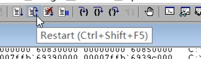
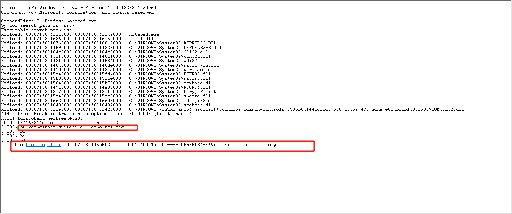
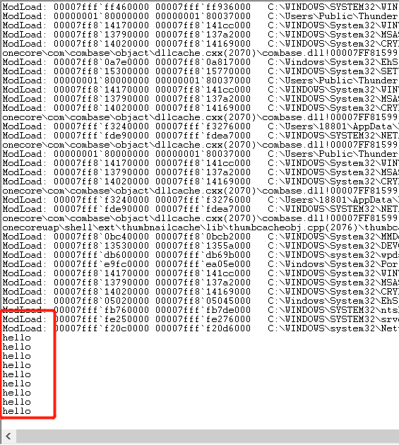
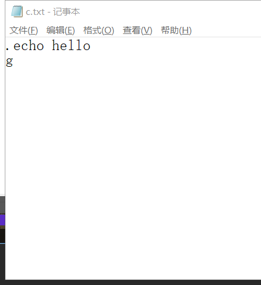
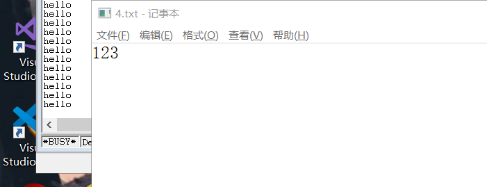
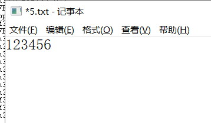
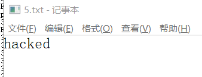
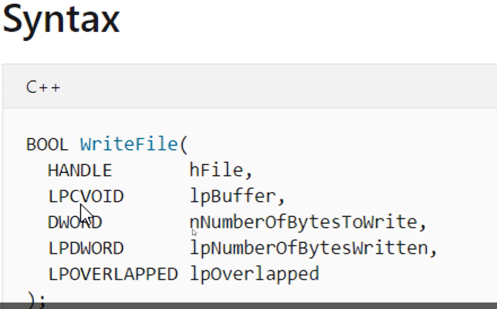

# 修改记事本
## 实验目的
* 利用Windeug进行劫持，修改数据
## 实验完成度
* [x] 当记事本输入123456时显示的是hacked
## 实验步骤
### 调试脚本
               
* 不退出调试器，重新执行            
              
* 调试
  1. windebug打开windows下面的记事本
  2. 下断点
  ```bash
  bu kernelbase!writefile ".echo hello;g"
  bl
  g
  ```
             
  3. 记事本弹出，随便输，然后保存，会输出hello                  
                 
  4. 将命令写到记事本中                 
                  
  5. 引入脚本文件                 
  ```bash
  bu kernelbase!writefile "$><C:\\Users\\18801\\Desktop\\c.txt"
  g
  ```
              
  * 脚本实例     
  ```bash
  .foreach (value {dd 61000 L4})
  {
   as /x ${/v:myAlias} value + 1
   .block{.echo value myAlias}
  }
  
  //foreach: 每行执行
  //dd: 查看内存内容  6100：地址   L4后面四个地址的内容
  //value: 每次查看的内容赋值给value
  //{
  //echo value
  //}
  //ad myAlias
  ```
### 演示实验
* 实验
  1. 脚本c.txt    
  ```bash
  as /mu content poi(esp+0n24)  # poi /mu  是字符串
  .block{.if($scmp("${content}","123456")==0){ezu poi(esp+0n24) "hacked";}.else{.echo content}}   # ezu 改值 u:unicode
  g
  ```
  2. 下断点              
  ```bash
  bu kernelbase!writefile "$><C:\\Users\\18801\\Desktop\\c.txt"
  g
  ```
  3. 保存123456后会显示hacked，需要刷新一下                     
                
                 
* 原理
  1. writefile函数
                  
  2. 因为64位，所以每个参数占8字节，32位的话就是4字节
  
              
               
