# 创建DLL
## 实验目的
* 能够自己手动创建DLL
## 实验完成度
* [x] 会编写dll。把.c文件编译为obj文件，把obj文件和lib文件链接为新的dll和lib文件。注意使用def文件定义导出函数。
* [x] 编写一个exe，调用第一步生成的dll文件中的导出函数。方法是（1）link时，将第一步生成的lib文件作为输入文件。（2）保证dll文件和exe文件在同一个目录，或者dll文件在系统目录。
* [x] 参考下面的链接，使用run time的方式，调用dll的导出函数。包括系统API和第一步自行生成的dll，都要能成功调用。
[参考资料](https://docs.microsoft.com/zh-cn/windows/win32/dlls/using-run-time-dynamic-linking)
> 命令提示
>link /dll /def:xxx.def 
>
>link xxx.lib /out:app.exe
>
>dumpbin /exports xxx.dll
> 
>dumpbin /imports xxx.exe    
## 实验步骤
### 了解dll
1. 实验代码
>D:\YearJunior1\SoftwareProjectSecurityDevelopmentLifecycle\EXP4
```cpp
a.c
int main()
{
	sub();
}

b.c
//修改前
int sub()
{
	return 0;
}
//修改后
#include<Windows.h>
int sub()
{
	MessageBox(0, "msg", 0, 0);
	return 0;
}
```
1. vs中运行一下，显示失败，因为函数里面没有sub()              
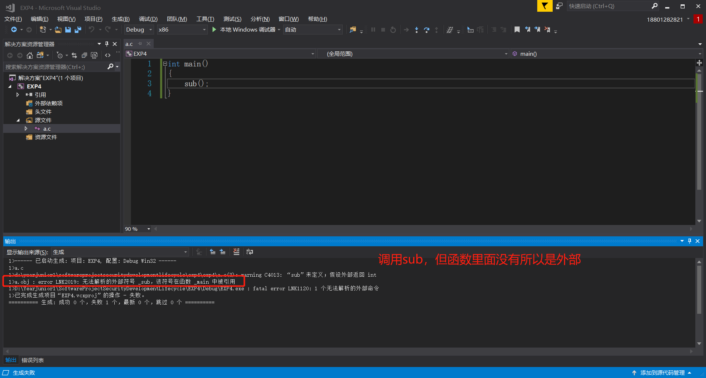               
1. 开发者工具，切换到a.c,b.c所在目录          
2. 编译```cl.exe /c b.c```，```cl.exe /c a.c```        
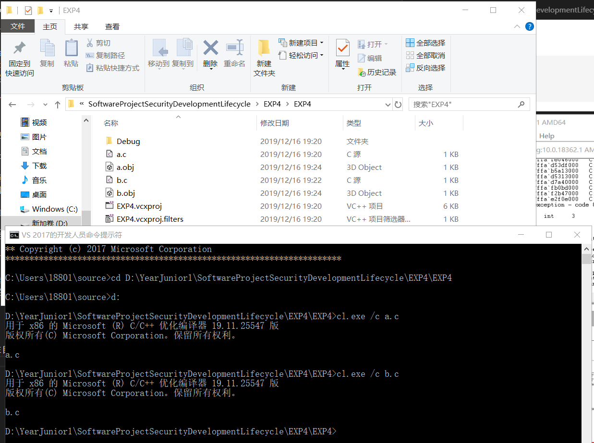              
3. 链接```link a.obj b.obj /out:haha.exe```              
4. 加入MessageBox函数后再进行链接，会失败               
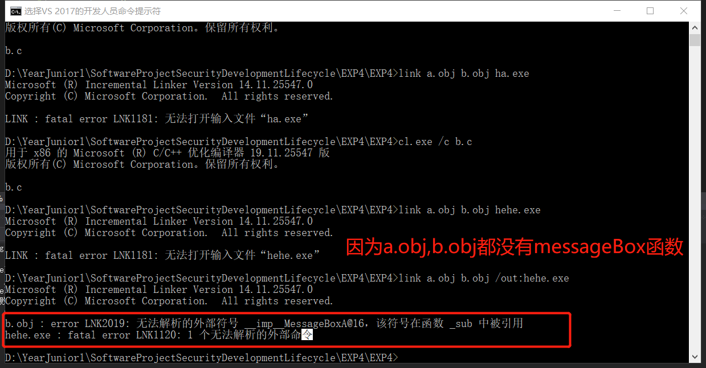              
5. 加入MessageBox函数所在的lib：```link a.obj b.obj User32.lib /out:hehe.exe```             
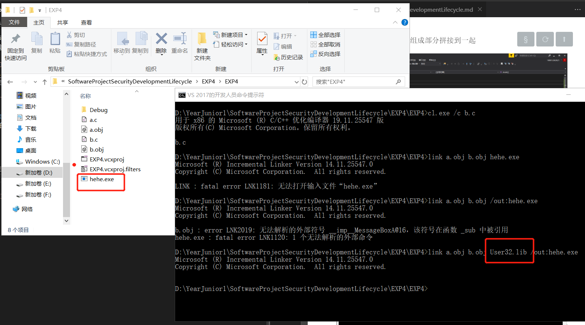           
6. ```dumpbin /imports hehe.exe```,查看调用的dll和外函数import MeaasgeBox但是没有sub()          
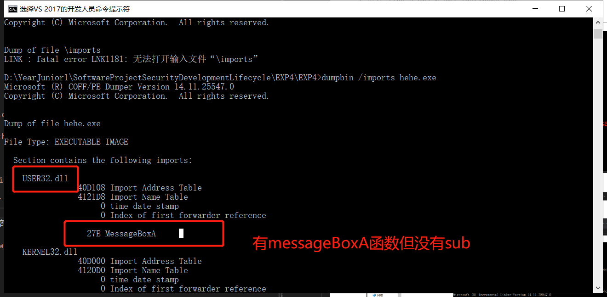               
7. ```dumpbin /exports C:\Windows\System32\User32.dll>user.txt```，```notepad hehe.exe```
8. ctal+F查找,找到函数
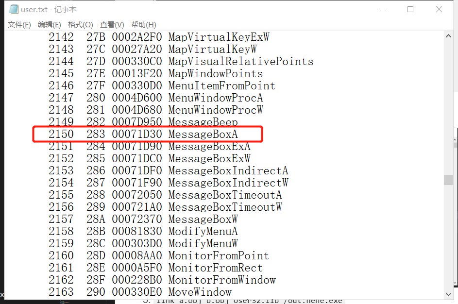                

### 编写DLL文件
> 参考资料：
>[模块定义文件](https://docs.microsoft.com/en-us/cpp/build/reference/module-definition-dot-def-files?view=vs-2019)                         
>[模块定义文件例子](https://docs.microsoft.com/en-us/cpp/build/exporting-from-a-dll-using-def-files?view=vs-2019)       

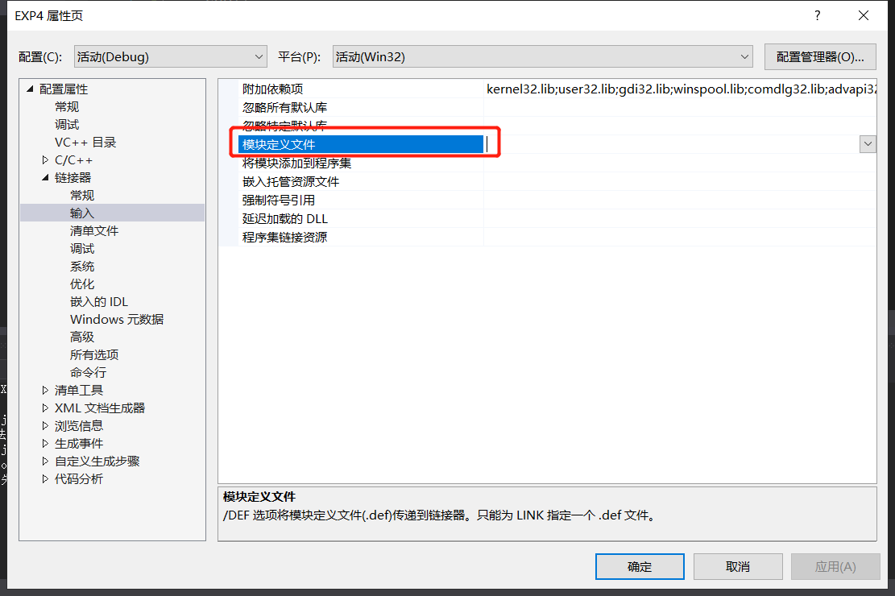            
>D:\YearJunior1\SoftwareProjectSecurityDevelopmentLifecycle\EXP4\Base1
```cpp
//base1.c
#include<Windows.h>
int intnal_function()
{
    return 0;
}
int lib_function(char * msg)
{
	MessageBoxA(0, "message from base lib", msg, MB_OK);
    return 0;
}

//exp.def

LIBRARY   baselib
EXPORTS
   lib_function
```
1. 开发者工具转到源代码目录```cd D:\YearJunior1\SoftwareProjectSecurityDevelopmentLifecycle\EXP4\Base1\Base1```
2. 链接```cl.exe /c base1.c```
3. ```link base1.obj User32.lib /dll /def:exp.def```得到dll文件，还有一个.lib文件                    
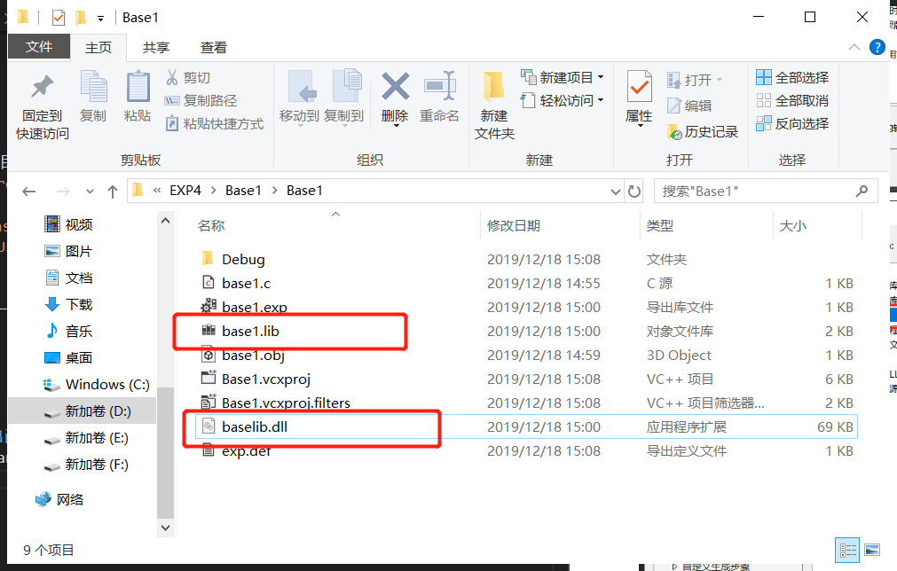                
4. 此时执行不能成功，改一下几个属性，能成功运行                 
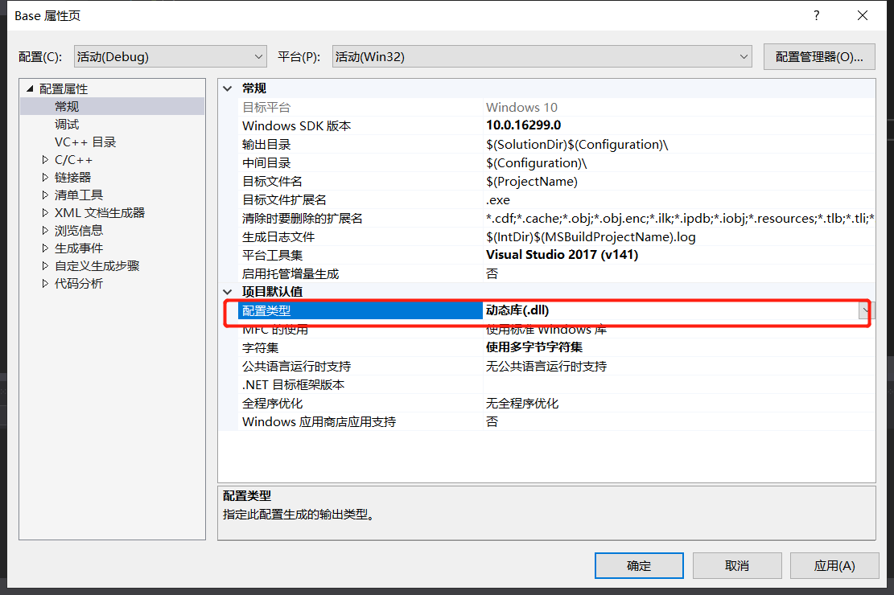               
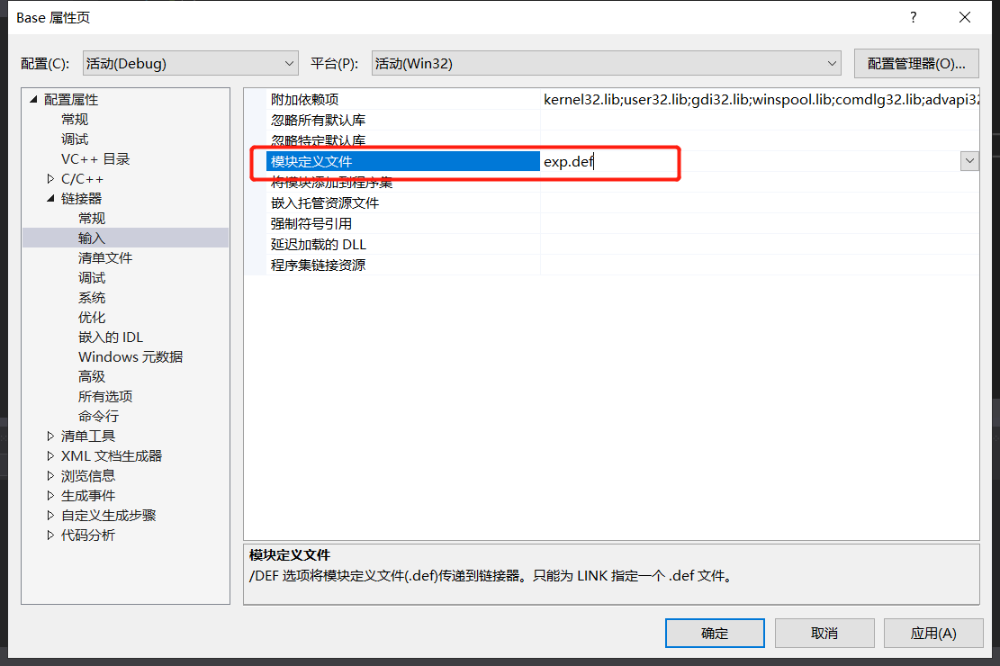              
5. 依赖附加项
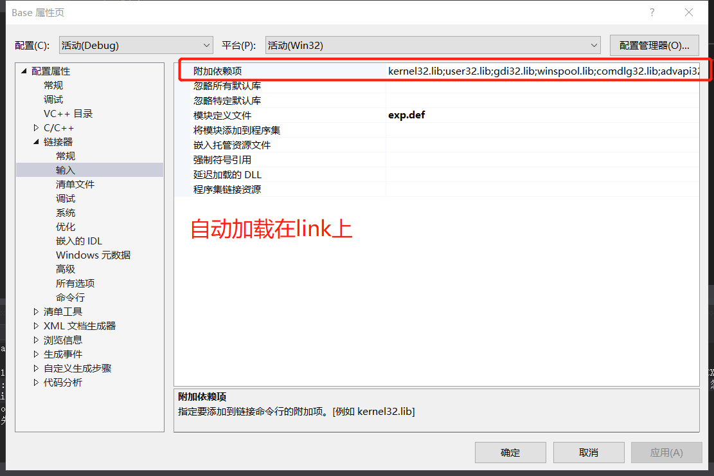                 

### load time的方式调用DLL的导出函数
>D:\YearJunior1\SoftwareProjectSecurityDevelopmentLifecycle\EXP4\APP

* 调运dll文件

```cpp
app.cpp
int main()
{
	lib_function("call a dll");
}
```
1. 把base1.lib，dll,.h复制过来
2. 开发者工具转到当前目录
3. ```cl.exe /c app1.c```
4. ```link app1.obj base1.lib /out:app.exe```，得到app.exe
5. ```app.exe```有弹出框，说明在只有.dll和.lib的情况下能够执行程序              
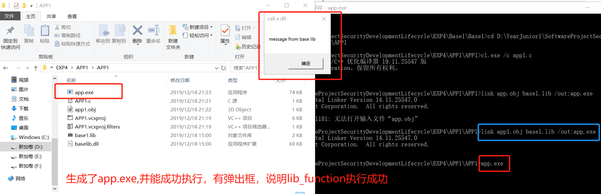            
6. ```dumpbin /imports app.exe```                     
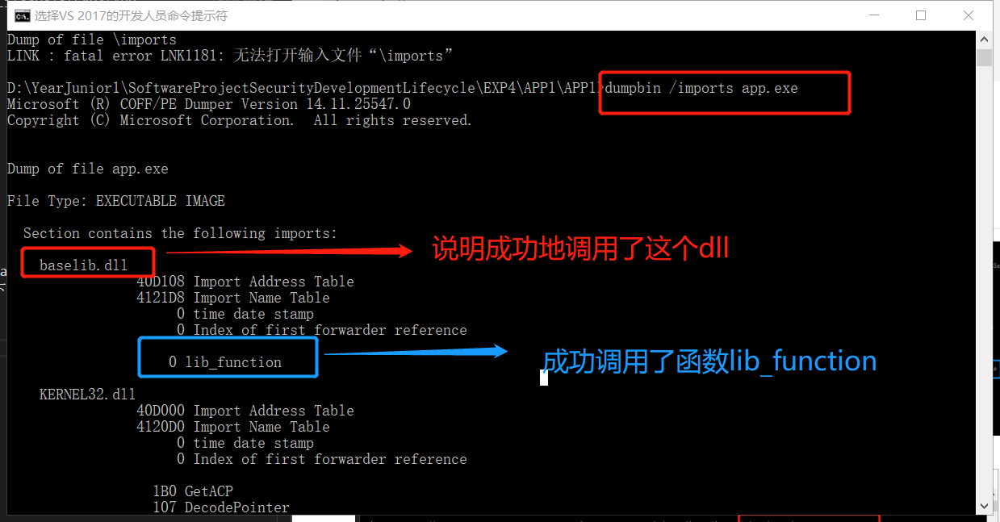              

### run time的方式调用DLL的导出函数
>[参考资料](https://docs.microsoft.com/zh-cn/windows/win32/dlls/using-run-time-dynamic-linking)

>D:\YearJunior1\SoftwareProjectSecurityDevelopmentLifecycle\EXP4\Load
1. 代码                 
```cpp
// A simple program that uses LoadLibrary and 
// GetProcAddress to access myPuts from Myputs.dll. 

#include <windows.h> 
#include <stdio.h> 

typedef int(__cdecl *MYPROC)(LPWSTR);

int main(void)
{
	HINSTANCE hinstLib;
	MYPROC ProcAdd;
	BOOL fFreeResult, fRunTimeLinkSuccess = FALSE;

	// Get a handle to the DLL module.

	hinstLib = LoadLibrary(TEXT("base1.dll"));

	// If the handle is valid, try to get the function address.

	if (hinstLib != NULL)
	{
		ProcAdd = (MYPROC)GetProcAddress(hinstLib, "myPuts");

		// If the function address is valid, call the function.

		if (NULL != ProcAdd)
		{
			fRunTimeLinkSuccess = TRUE;
			(ProcAdd)(L"Message sent to the DLL function\n");
		}
		// Free the DLL module.

		fFreeResult = FreeLibrary(hinstLib);
	}

	// If unable to call the DLL function, use an alternative.
	if (!fRunTimeLinkSuccess)
		printf("Message printed from executable\n");

	return 0;

}
```                  
2. 将base1.dll,.lib复制到load.c目录下，运行                                 
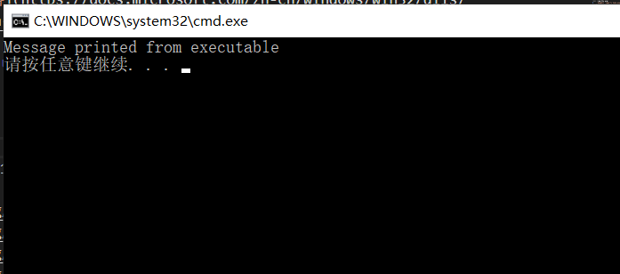              


## 实验结论
* 静态链接是指源代码在可执行程序内部，在同一文件里面，相对位置不变。动态链接是指代码不在exe内，需要运行时去寻找，相对位置是改变的
* 为什么要动态链接
  * 静态链接越要编译好的机器指令在exe中放一份，例如print会被复制很多个，可执行文件会非常大，会有空间的浪费
  * 当代码出现问题，要进行升级时，需要将所有调用这个函数的代码都升级一遍。如果单独放在一个文件中就只需要改这一个文件
  * 开发一个基础平台，不用开发源代码，用可以让更多人调用。起到了闭源系统同样能开放的功能
  * 没有动态链接，操作系统会异常臃肿和庞大，不宜升级和更新。能保证基础代码只有一个拷贝就可以。新编写的代码只是基础代码的增量。
* load time 特点是exe文件导入表中会出先需要调用的dll文件名及函数名，并且在link 生成exe时，需明确输入lib文件。
## 实验问题
## 参考文献 