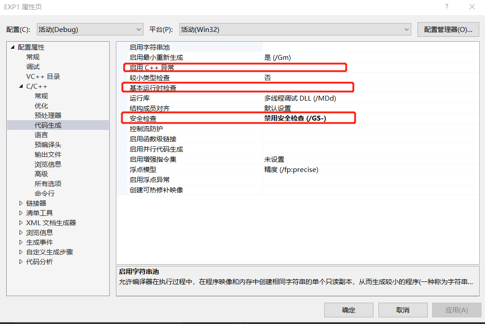
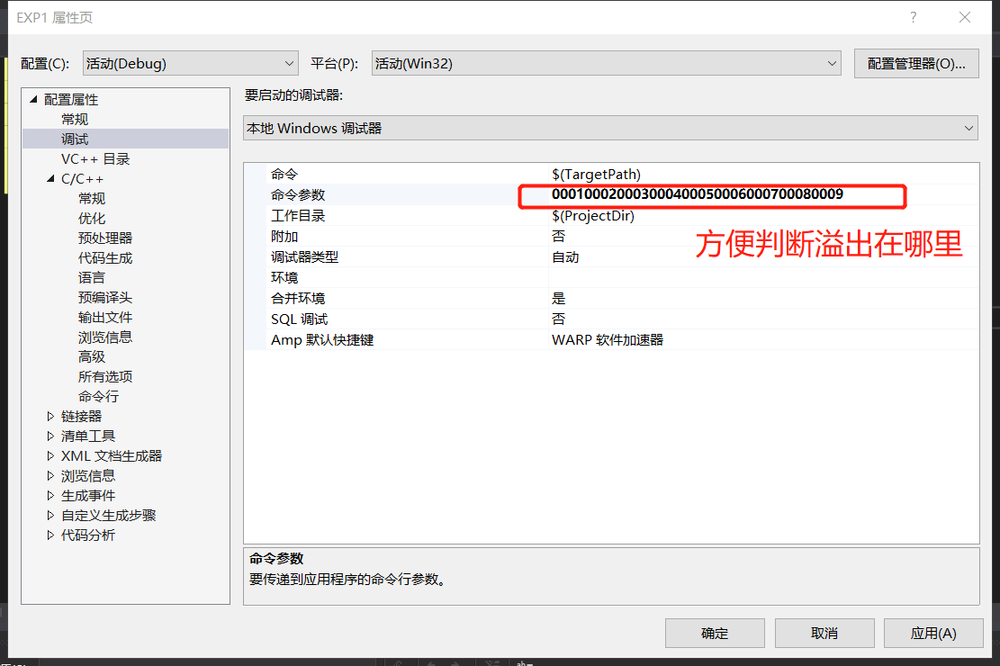
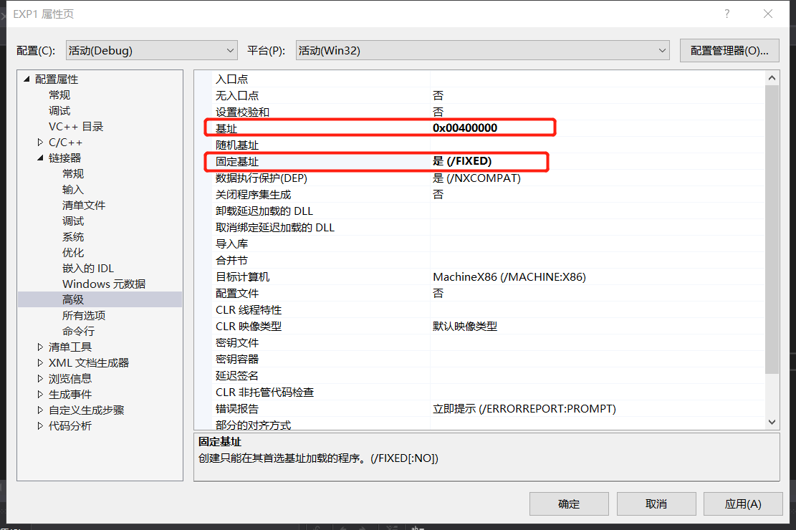
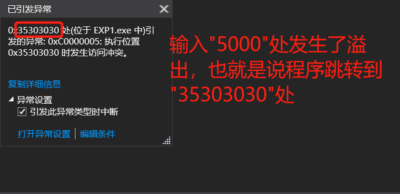
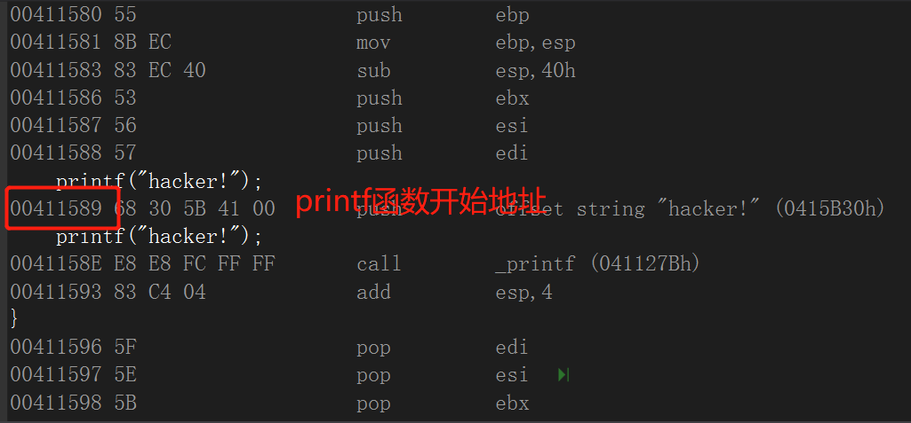
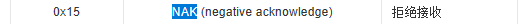

# 堆溢出漏洞
## 实验目的
* 了解堆溢出漏洞原理
## 实验完成度
* [x] 模拟堆溢出过程
## 实验步骤
1. 实验代码            
  ``` c
  #include<stdlib.h>
  #include<string.h>
  #include<stdio.h>
   
  void hack()
  {
    printf("hacker!");
  } 

  int main(int argc,char** argv)
  {
    char y[10];
    if(argc>1)
    {
      strcpy(y,argv[1]);
    }
  }

  ```     
  整个代码并没执行```printf("hacker!");```,但堆溢出后会执行这行代码           
2. 修改属性           
  修改安全属性            
         
               
  因为后面要用haker处函数的起始地址替换溢出地址，所以需要固定地址                       
              
3. 单步执行代码，直至发生错误报告          
   输入"5000"处发生了溢出，也就是说程序跳转到"35303030"处,只要将```printf("haker");```处的地址替换掉输入出的"5000"          
                     
4. 转到反汇编，找到```printf("haker");```地址               
                  
5. 因为有十六进制无法转换，更改基地址或者再加一个函数
           
                            
  
                 
                 
                 
                 
                 
                 
                 
                 
                 
                 
                 
                 
                 
                 
                 
                 
                 
                 
                 
                 
                 
## 实验结论
* printf函数所对应地址的十六进制无法转化成一般字符，有数字对应着特殊字符           
            
  解决方法就是跟换基地址进行多次尝试或者再加一个函数                         
                 
                 
                 
                 
                 
                 
                 
                 
                 
                 
## 参考资料