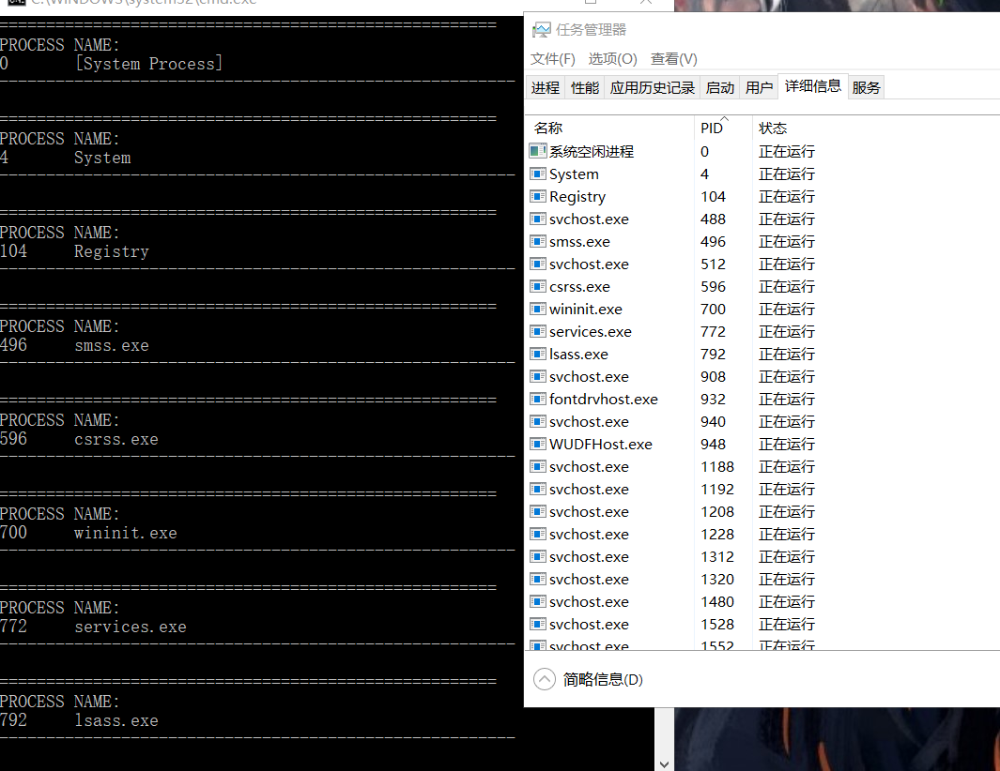
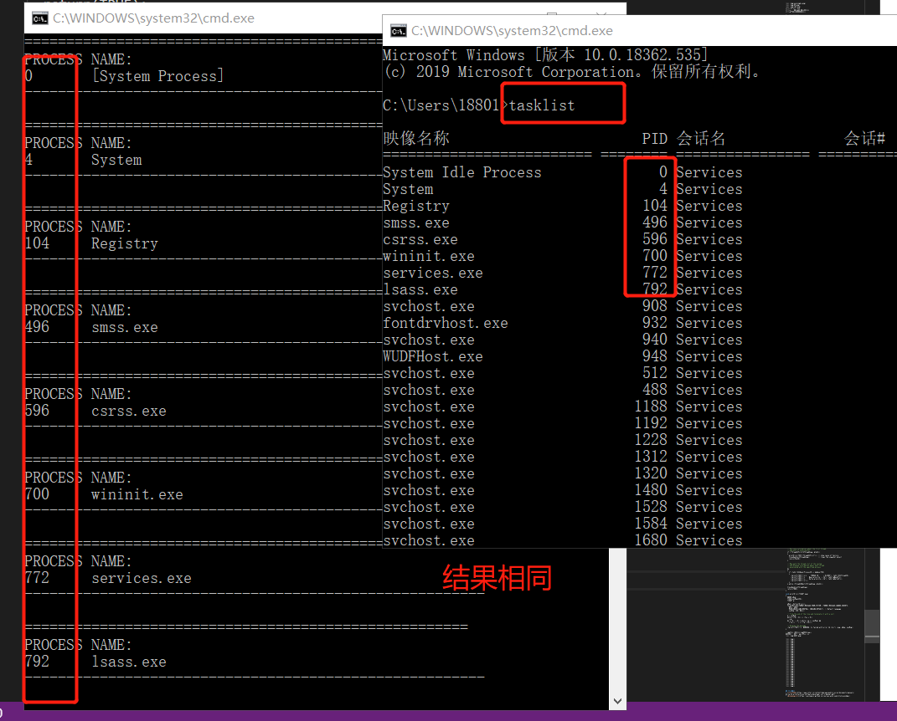
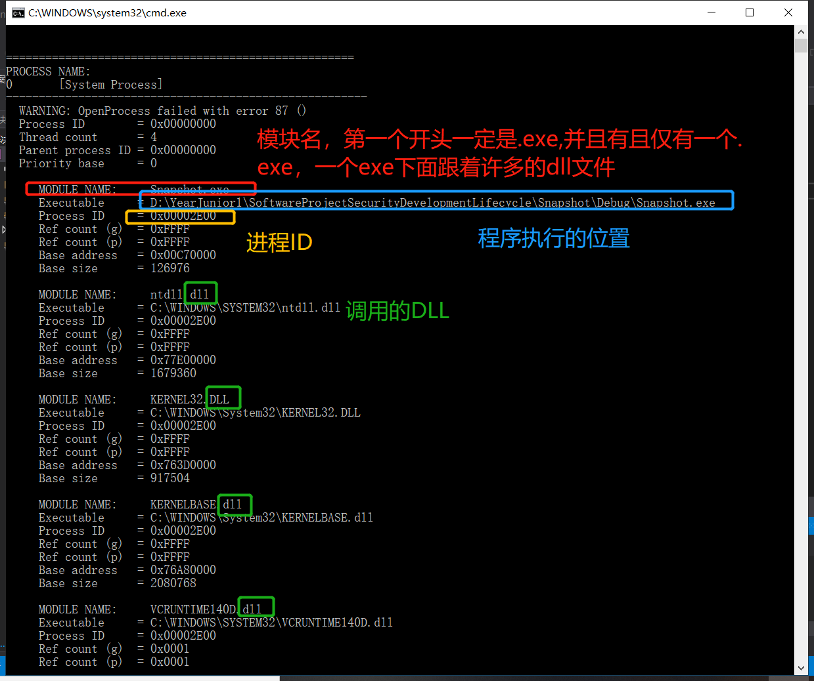
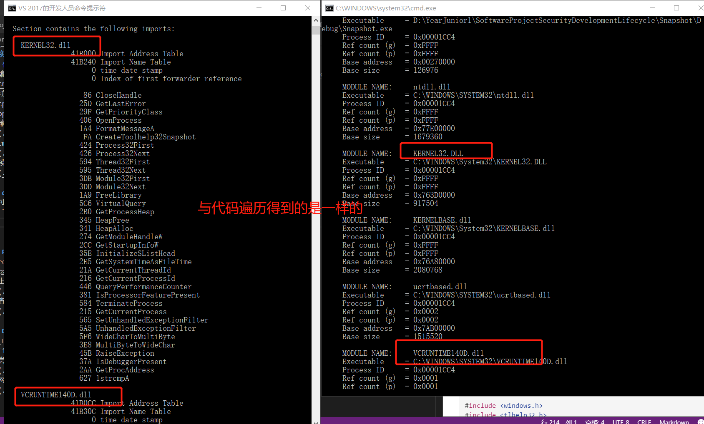
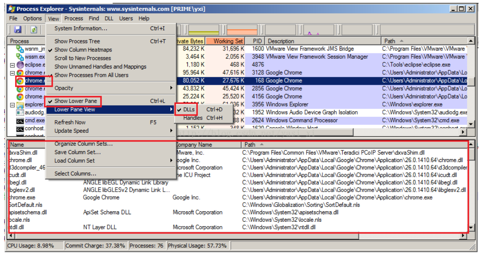
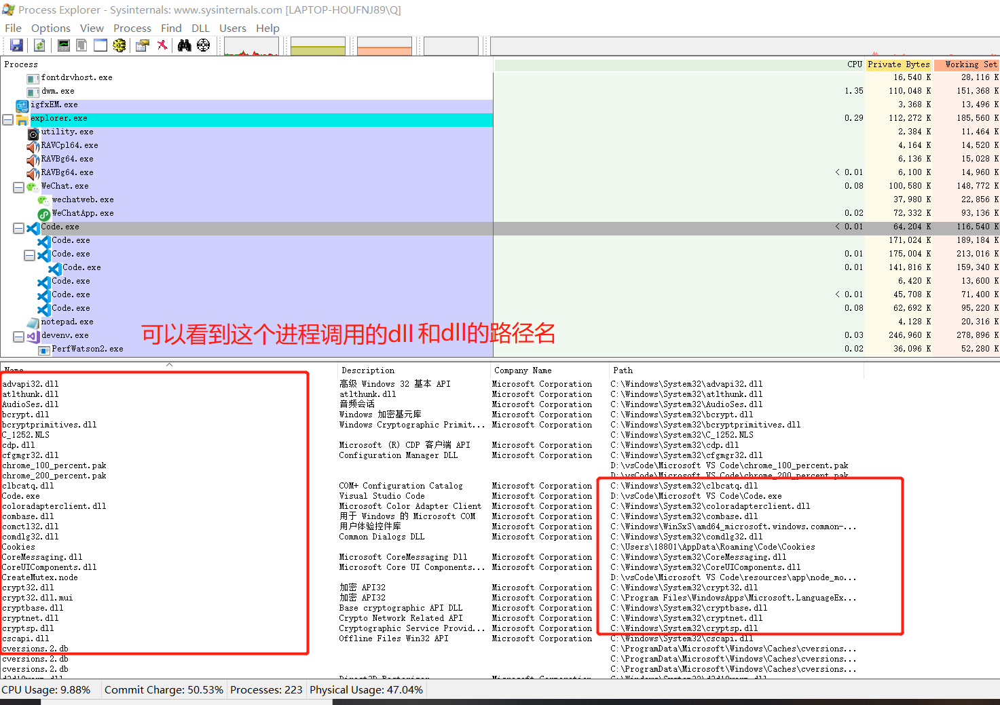
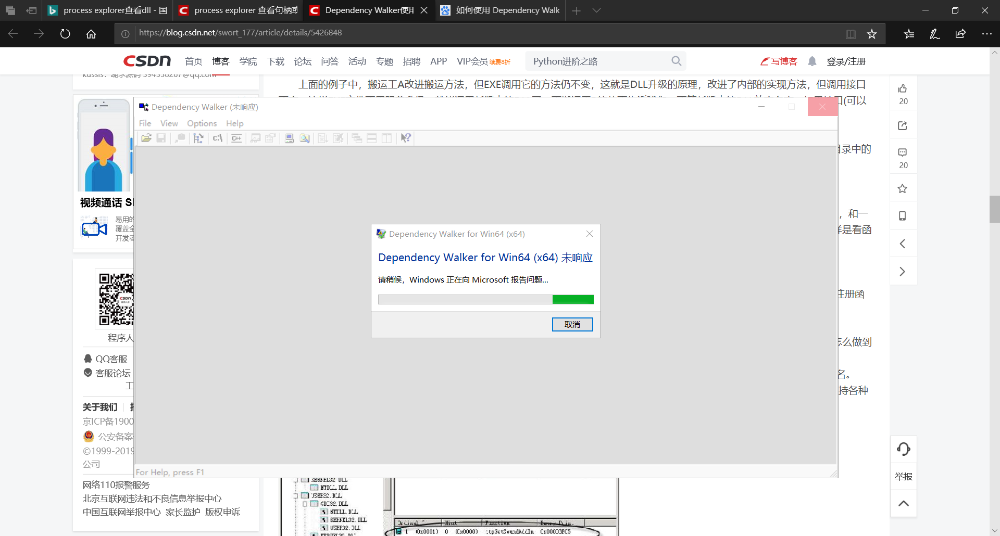
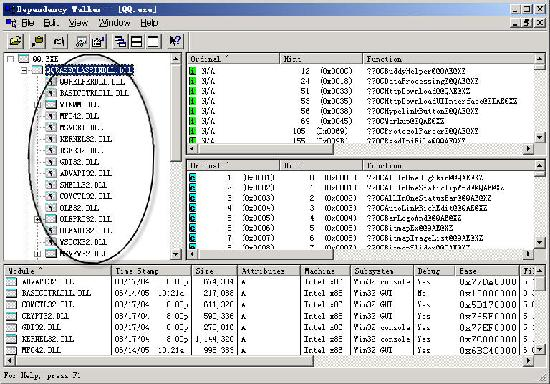

# 查看DLL

## 实验目的
* 能够自己手动创建DLL
## 实验完成度
* [x] 综合使用课上使用的模块遍历代码，结合三个工具dumpbin,Process Explorer,Dependency Walker查看DLL，分析比较三个工具的不同   
## 实验步骤
### 代码遍历
1. 编写代码遍历[Taking a Snapshot and Viewing Processes-遍历当前的所有进程](https://docs.microsoft.com/zh-cn/windows/win32/toolhelp/taking-a-snapshot-and-viewing-processes) 
> 存放在D:\YearJunior1\SoftwareProjectSecurityDevelopmentLifecycle\Snapshot            
```cpp
#include <windows.h>
#include <tlhelp32.h>
#include <tchar.h>
#include<stdio.h>
#include<stdlib.h>

//  Forward declarations:
BOOL GetProcessList();
BOOL ListProcessModules(DWORD dwPID);
BOOL ListProcessThreads(DWORD dwOwnerPID);
void printError(TCHAR* msg);

int main(void)
{
	GetProcessList();
	return 0;
}

BOOL GetProcessList()
{
	HANDLE hProcessSnap;
	HANDLE hProcess;
	PROCESSENTRY32 pe32;
	DWORD dwPriorityClass;

	
	hProcessSnap = CreateToolhelp32Snapshot(TH32CS_SNAPPROCESS, 0);  
	//得到快照句柄，系统对象可被操作的对象ID，文件窗口，进程，现场
	                                                                  
	if (hProcessSnap == INVALID_HANDLE_VALUE)
	{
		printError(TEXT("CreateToolhelp32Snapshot (of processes)"));
		return(FALSE);
	}

	// Set the size of the structure before using it.
	pe32.dwSize = sizeof(PROCESSENTRY32);

	//***********************进程的遍历*****************************************************8
	if (!Process32First(hProcessSnap, &pe32))
	{
		printError(TEXT("Process32First")); // show cause of failure
		CloseHandle(hProcessSnap);          // clean the snapshot object
		return(FALSE);
	}

	
	do
	{
		_tprintf(TEXT("\n\n====================================================="));
		_tprintf(TEXT("\nPROCESS NAME:  \n%d\t%s"), pe32.th32ProcessID,pe32.szExeFile);
		_tprintf(TEXT("\n-------------------------------------------------------"));

		if(lstrcmp(pe32.szExeFile,TEXT("chrome.exe")))
		{
			// Retrieve the priority class.
			dwPriorityClass = 0;
			hProcess = OpenProcess(PROCESS_ALL_ACCESS, FALSE, pe32.th32ProcessID);
			if (hProcess == NULL)
				printError(TEXT("OpenProcess"));
			else
			{
				dwPriorityClass = GetPriorityClass(hProcess);
				if (!dwPriorityClass)
					printError(TEXT("GetPriorityClass"));
				CloseHandle(hProcess);
			}

			_tprintf(TEXT("\n  Process ID        = 0x%08X"), pe32.th32ProcessID);
			_tprintf(TEXT("\n  Thread count      = %d"), pe32.cntThreads);
			_tprintf(TEXT("\n  Parent process ID = 0x%08X"), pe32.th32ParentProcessID);
			_tprintf(TEXT("\n  Priority base     = %d"), pe32.pcPriClassBase);
			if (dwPriorityClass)
				_tprintf(TEXT("\n  Priority class    = %d"), dwPriorityClass);

			
			ListProcessModules(pe32.th32ProcessID);
			ListProcessThreads(pe32.th32ProcessID);
	    }

	} while (Process32Next(hProcessSnap, &pe32));

	//***********************进程的遍历*****************************************************8


	CloseHandle(hProcessSnap);
	return(TRUE);
}


BOOL ListProcessModules(DWORD dwPID)
{
	HANDLE hModuleSnap = INVALID_HANDLE_VALUE;
	MODULEENTRY32 me32;

	// Take a snapshot of all modules in the specified process.
	hModuleSnap = CreateToolhelp32Snapshot(TH32CS_SNAPMODULE, dwPID);  //TH32CS_SNAPMODULE：获得dwPID下所有线程的快照
	if (hModuleSnap == INVALID_HANDLE_VALUE)
	{
		printError(TEXT("CreateToolhelp32Snapshot (of modules)"));
		return(FALSE);
	}

	// Set the size of the structure before using it.
	me32.dwSize = sizeof(MODULEENTRY32);

	
	//***********************模块的遍历*****************************************************8
	if (!Module32First(hModuleSnap, &me32))
	{
		printError(TEXT("Module32First"));  // show cause of failure
		CloseHandle(hModuleSnap);           // clean the snapshot object
		return(FALSE);
	}

	do
	{
		_tprintf(TEXT("\n\n     MODULE NAME:     %s"), me32.szModule);
		_tprintf(TEXT("\n     Executable     = %s"), me32.szExePath);
		_tprintf(TEXT("\n     Process ID     = 0x%08X"), me32.th32ProcessID);
		_tprintf(TEXT("\n     Ref count (g)  = 0x%04X"), me32.GlblcntUsage);
		_tprintf(TEXT("\n     Ref count (p)  = 0x%04X"), me32.ProccntUsage);
		_tprintf(TEXT("\n     Base address   = 0x%08X"), (DWORD)me32.modBaseAddr);
		_tprintf(TEXT("\n     Base size      = %d"), me32.modBaseSize);

	} while (Module32Next(hModuleSnap, &me32));
	//***********************模块的遍历*****************************************************8
	CloseHandle(hModuleSnap);
	return(TRUE);
}

BOOL ListProcessThreads(DWORD dwOwnerPID)
{
	HANDLE hThreadSnap = INVALID_HANDLE_VALUE;
	THREADENTRY32 te32;

	// Take a snapshot of all running threads  
	hThreadSnap = CreateToolhelp32Snapshot(TH32CS_SNAPTHREAD, 0);
	if (hThreadSnap == INVALID_HANDLE_VALUE)
		return(FALSE);

	// Fill in the size of the structure before using it. 
	te32.dwSize = sizeof(THREADENTRY32);


	//***********************线程的遍历*****************************************************8
	if (!Thread32First(hThreadSnap, &te32))
	{
		printError(TEXT("Thread32First")); // show cause of failure
		CloseHandle(hThreadSnap);          // clean the snapshot object
		return(FALSE);
	}

	do
	{
		if (te32.th32OwnerProcessID == dwOwnerPID)
		{
			_tprintf(TEXT("\n\n     THREAD ID      = 0x%08X"), te32.th32ThreadID);
			_tprintf(TEXT("\n     Base priority  = %d"), te32.tpBasePri);
			_tprintf(TEXT("\n     Delta priority = %d"), te32.tpDeltaPri);
			_tprintf(TEXT("\n"));
		}
	} while (Thread32Next(hThreadSnap, &te32));
	//***********************线程的遍历*****************************************************8
	CloseHandle(hThreadSnap);
	return(TRUE);
}

void printError(TCHAR* msg)
{
	DWORD eNum;
	TCHAR sysMsg[256];
	TCHAR* p;

	eNum = GetLastError();
	FormatMessage(FORMAT_MESSAGE_FROM_SYSTEM | FORMAT_MESSAGE_IGNORE_INSERTS,
		NULL, eNum,
		MAKELANGID(LANG_NEUTRAL, SUBLANG_DEFAULT), // Default language
		sysMsg, 256, NULL);

	// Trim the end of the line and terminate it with a null
	p = sysMsg;
	while ((*p > 31) || (*p == 9))
		++p;
	do { *p-- = 0; } while ((p >= sysMsg) &&
		((*p == '.') || (*p < 33)));

	// Display the message
	_tprintf(TEXT("\n  WARNING: %s failed with error %d (%s)"), msg, eNum, sysMsg);
}
```             
>.cpp改为.c文件，就可以运行成功                
1. 输出结果与任务栏管理器差不多            
               
2. cmd中输入```tasklist```，系统显示输出的进程,程序查看的与cmd中的输出是一样的              
                           
3. 模块
                

### dumpbin
1. 可以用开发者工具进入到Snapshot.exe目录    
2. ```dumpbin /imports Snapshot.exe```,查看导入的dll                  
3. dumpbin查看的dll是与代码遍历得到的dll是一样的
              

### Process Explorer
>[Process Explorer下载链接]((https://docs.microsoft.com/zh-cn/sysinternals/))
1. 运行Process Explorer
2. 上面窗口的view->show lower pane->;view->lower pane views->DLLs，显示dll                       
              
3. 查看vscode所用的dll                      
            

### Dependency Walker
>* [Dependency Walker下载链接](http://www.dependencywalker.com/)                
1. File->open->打开一个.exe
2. 尝试失败，无论打开什么软件都是未响应                
              
3. 网上搜索
               


## 实验结论
* 代码遍历和Process Explorer最后都能得到这一台主机上所有的进程和他相关的线程，以及可以查看每个进程调用的dll,而Dependency Walker和dumpbin不能对所有的进程进行遍历，他们只能查看具体的exe所调用的dll,还能查看某个dll调用了那些函数。
## 实验问题
## 参考资料
  * [Process Explorer](https://docs.microsoft.com/zh-cn/sysinternals/)                  
  * [Dependency Walker](http://www.dependencywalker.com/)                       