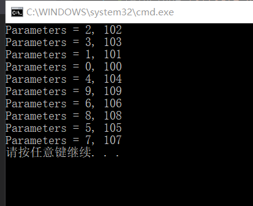

# 线程与进程
## 实验目的
* 了解线程
* 了解多线程和单线程的区别
* 了解进程
* 了解进程间的父子关系
## 实验完成度
* [x] 从本地查看进程与线程
* [x] 执行多线程程序并了解多线程执行特点
* [x] 执行单线程并了解单线程与多线程的区别
* [x] 执行进程函数
* [x] 通过processExplore中查看进程间的父子关系
## 实验步骤
### 查看本地的进程
  任务管理器中->性能          
                   
  从中可以发现：    
  * 线程的数量远远大于逻辑处理器的数量，而多个线程同时执行是采用了时间片的方法，通过时间片来轮流执行多个线程       
  * 线程数远远大于进程数，平均每个进程会调用大约十多个线程          
    
### CreateThread
* 多线程执行任务     
  1. 从[CreateThreads官方参考资料](https://docs.microsoft.com/en-us/windows/win32/api/processthreadsapi/nf-processthreadsapi-createthread)复制实例代码到一个新的工程项目         
                   
  2. 将3改为10
                   
  3. 运行，执行成功
         
  对运行几次这个程序会发现：     
  * 线程的序号总体是一种随机性，说明线程并不是顺序执行而是同时执行，但是多运行几次， 会发现从整体上来说小序号的在上面执行       
  4. 为了简便对程序的理解，对实例代码进行一些修改         
                
                 
        
  5. 为了更加突出多线程与单线程的区别，对实例代码进行一些修改
              
                
             
  6. 重新编译运行，得到如下结果
             
  每个线程都sleep了1000但是总体时间显示只用了1032，所以这个可以证明线程不是顺序执行的，而是同时执行，但每个线程的完成所需的时间是不一样的
* 单线程执行任务       
  1. 将多线程改为单线程执行
                  
              
           
  2. 重新执行        
  重新执行发现： 
    *  结果的打印变慢了。是一行一行地慢慢打印，而不是像多线程一样一起打印，这说明在单线程的情况下，任务是一个个的做
    * 打印出来显示地序号也是顺序显示的，说明在单线程的情况下程序是一个一个顺序执行的
    * 执行完所用的总时间是10141，是多线程执行所需要时间的10倍，这也表明了在单线程的情况下是一个一个顺序执行              
                  
  
### CreateProcess 
* 示例代码执行
   1. 从[CreateProcess官方参考资料](https://docs.microsoft.com/en-us/windows/win32/api/processthreadsapi/nf-processthreadsapi-createprocessa)复制实例代码       
   3. 运行cmd，进入exe所在位置
   ```
   >>cd D:\YearJunior1\SoftwareProjectSecurityDevelopmentLifecycle\EXP3\Debug
   >>d:
   ```
   4. 执行exe能成功
   ```>>EXP3.exe```
   5. 执行```>>EXP3.exe "EXP3.exe notepad.exe"```
          
   6. 关闭notepad,EXP3也消失
                 
* processExplore
   1. 运行processExplore         
                    
   2. 执行 ```>>EXP3.exe "EXP3.exe notepad.exe"```
   3. 从processExplore中查找``EXP3.exe``和``notepad.exe``        
                    
   从中可以发现三个进程之间具有一定的层次关系，是一个调一个。两个EXP3.exe之间是存在这父子关系，而EXP3.exe与之间又存在着父子关系，第一个与notepad.exe之间存在着祖孙关系
   4. 关闭notepad.exe之后三个进程都消失             
                    

## 实验结论
   * 一个exe其实就相当于一个进程，而一个进程又可以调用多个线程，而时间片的引入使得多个线程可以同时执行
   * 多线程是同时执行，减少了执行时间，由上面的CreateThread实验中多线程执行时显示的序号的随机性和执行完花费的总时间与单线程相对比，可以得出多线程是同时执行的结论
   * 进程与进程之间存在着一个调一个也就是父子关系。当父进程结束时，对应的子进程也会随之结束。而当子进程结束时，如果父进程没有其他子进程是，父进程也会结束     
         
## 实验问题
## 参考资料
   * [CreateThreads msdn 官方参考资料](https://docs.microsoft.com/en-us/windows/win32/api/processthreadsapi/nf-processthreadsapi-createthread)
   * [CreateProcess msdn 官方参考资料](https://docs.microsoft.com/en-us/windows/win32/api/processthreadsapi/nf-processthreadsapi-createprocessa)
