# 二进制缓冲区溢出漏洞
## 实验目的
  * 通过实验了解二进制缓冲区溢出漏洞的基本原理
## 实验步骤
* 实验基础配置   
    1. vs中开启一个新的工程文件    
    ```c
    #define _CRT_SECURE_NO_WARNINGS
    //没有这一行代码会错误，因为strcpy是不安全的，这个不让报错
    // CRT:C RUN TIME
    #include <stdlib.h>
    #include <stdio.h>
    #include <string.h>

    int sub(char* x)
    {
	    char y[10];
	    strcpy(y, x);    //❌   溢出会在此处发生
	    return 0;
    }

    int main(int argc, char** argv)
    {
	    if (argc > 1)
		    sub(argv[1]);
	    printf("exit");
    }
    ```
    2. 设置配置文件   
    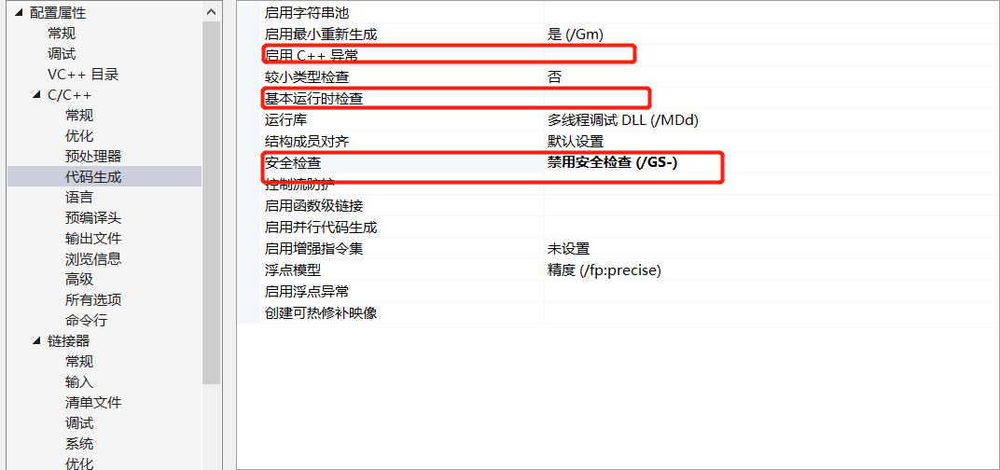
    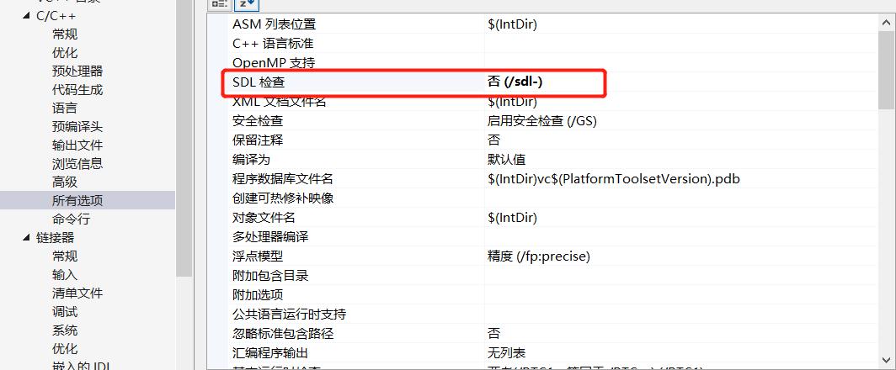
    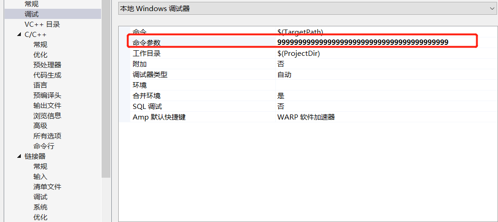
* sub函数调用strcpy
    1. 确定是debug运行状态
    2. 下断点在strcpy，开始调试
    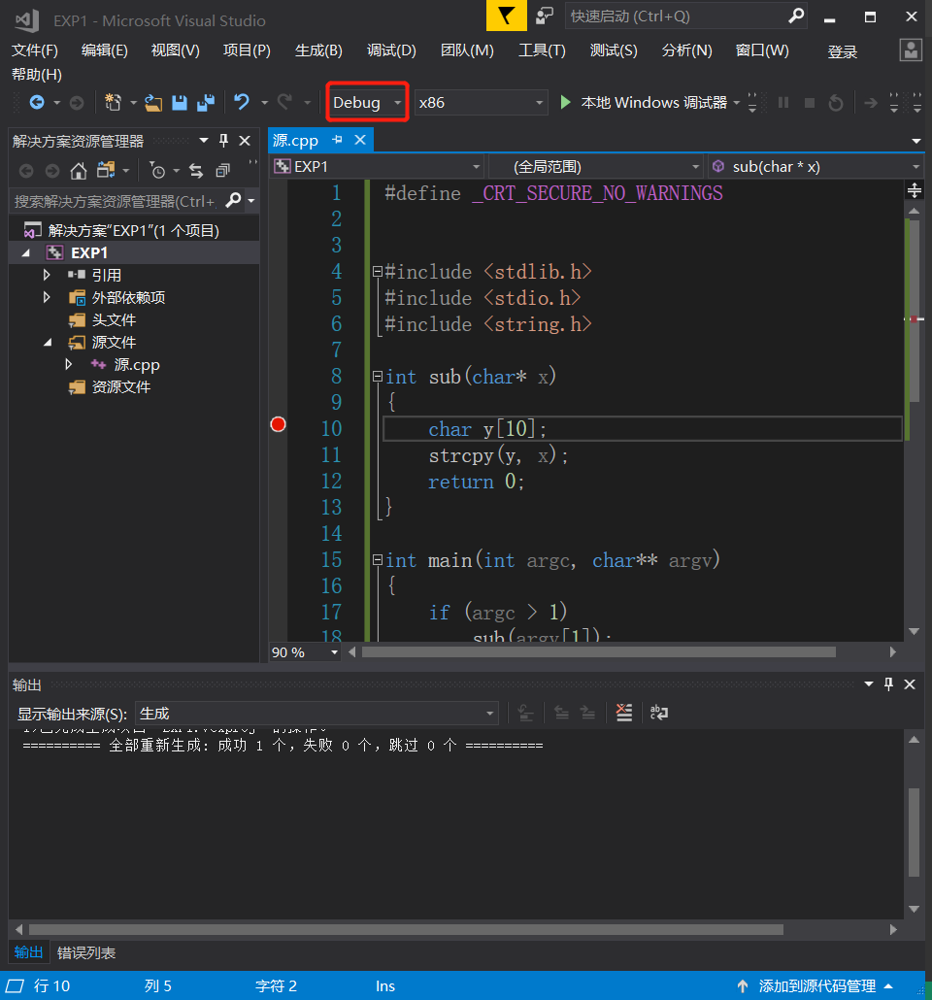
    3. 转到反汇编，右键，去掉显示符号名，勾上"显示地址""显示源代码""显示代码字节"
    4. 调试->窗口->内存,调试->窗口->寄存器。打开内存和寄存器窗口   
       EIP 指令指针寄存器，EIP所指向的地址就是代码执行到的那一步地址，地址处所存储的内容就是此时将要执行对应的机器指令   
       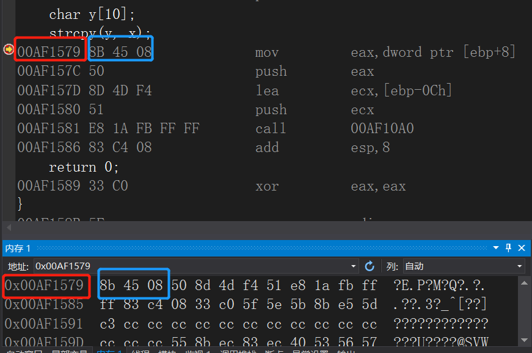     
    5. F10,执行一步，发现EIP,EAX都改变
       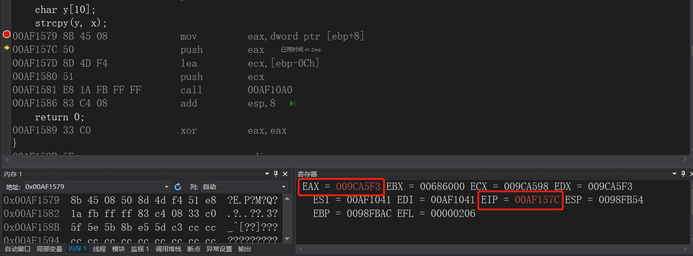    
       EAX就是x的地址，ECX是y  
       内存->eax
       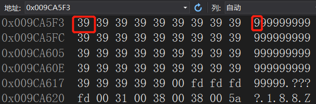
       “9”->“0x39”,00字符串结束,发现eax所指向的地址中的确存储这我们定的一串的"9" 
    6. F10再执行一步，发现ESP的值也发生了改变，与原来相比"-4"，说明将x进行了入栈的操作   
      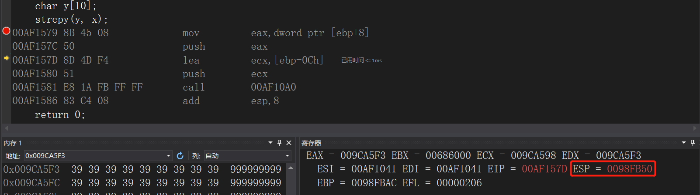   
      在内存中输入esp    
      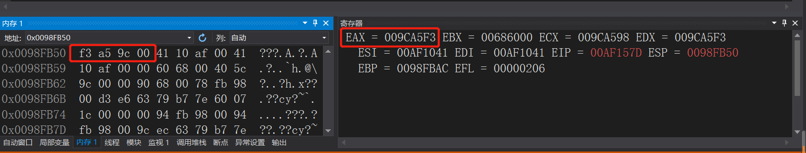   
      发现ESP中所存入的地址就是EAX中所存的地址，说明此时的x是入栈了    
    7. 下面两行指令则是给y[10]分配空间，esp指向的是ECX里的地址，y入栈  
       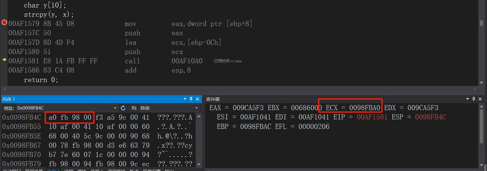
    8. F10，指令执行到call的地方，F11进入函数    
       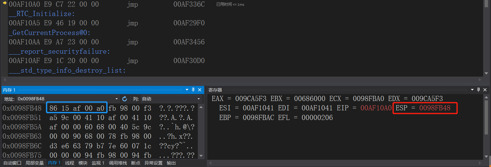   
       执行函数会发现，esp的值-4，说明此时入栈了一样东西，查看esp所存储的地址，发现他存储的是下一条指令的地址
    9. 进入strcpy函数无法出来，断开调试

* main调用sub函数，sub函数调用strcpy函数
    1. 在main函数中增加一个断点
    2. F10，F11进入sub函数，再F10执sub
    3. 到call strcpy函数时F10执行，执行完return 0函数
       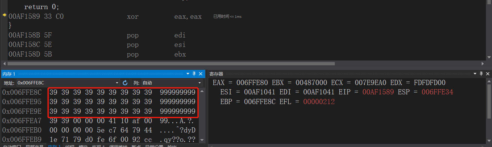   
       此时内存查看ebp（基址指针）时发现，正常情况下，ebp的下面应该存储的是sub的下一条指令地址，但是此时的ebp和下面（返回地址）中间存储的都是999……，正确的返回地址被覆盖
    4. 执行完sub函数后，会发现报错
       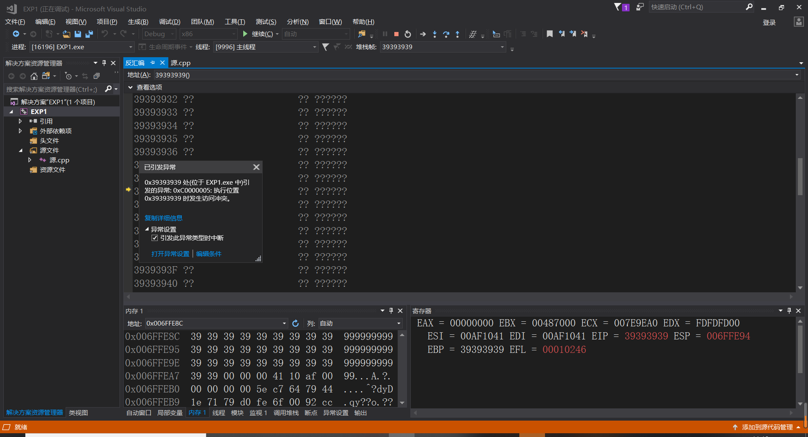
       EIP跳转到了地址为39393939的地方，发生了报错，跳到了一个未知的地方。

## 实验结论
   * 最后因为y的缓冲区溢出导致9999……覆盖了正确的返回地址，使函数跳转到了一个未知的地方。又因为这个输入是用户输入，而不是程序员定义的，所以这里就有一个漏洞，当溢出的数据覆盖后的地址是一个有意义的地址时，函数会继续执行下去，就相当中了一个病毒。
   * 函数调用
    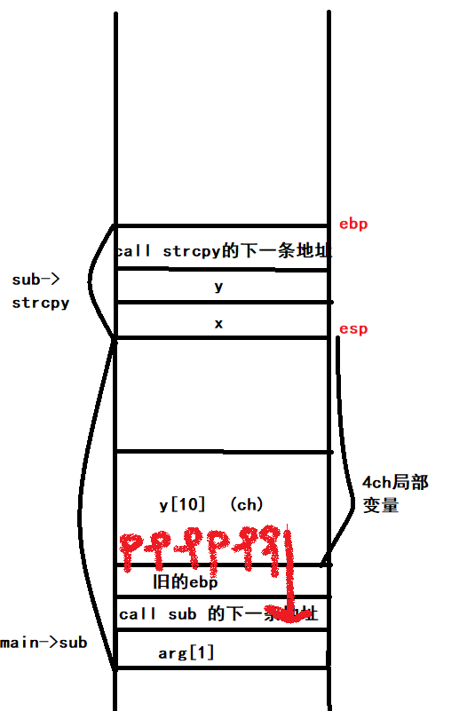
